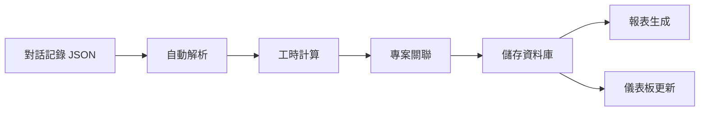
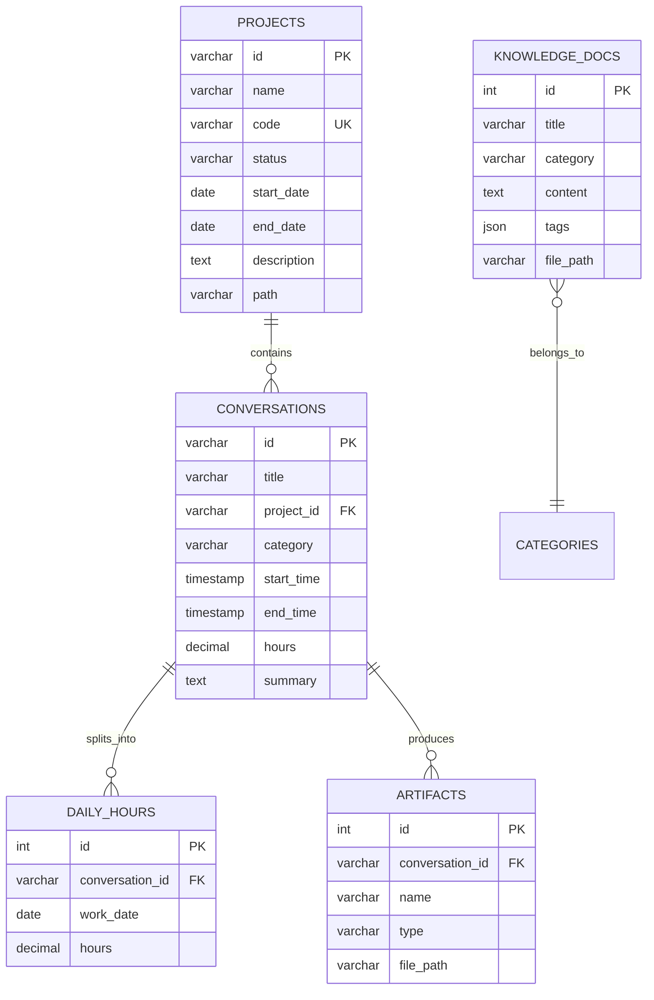
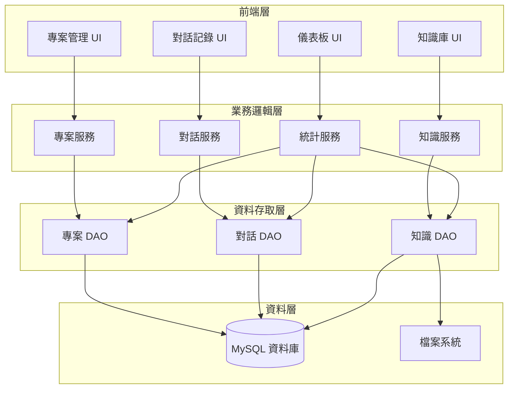
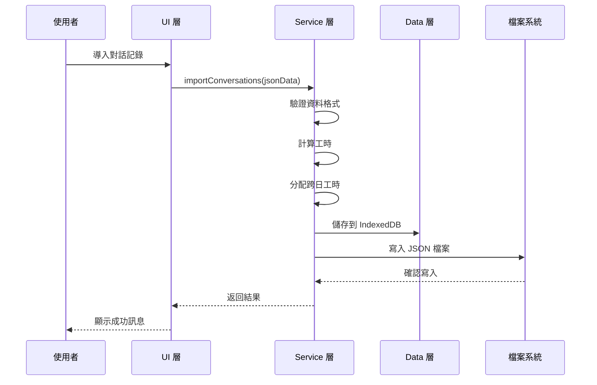
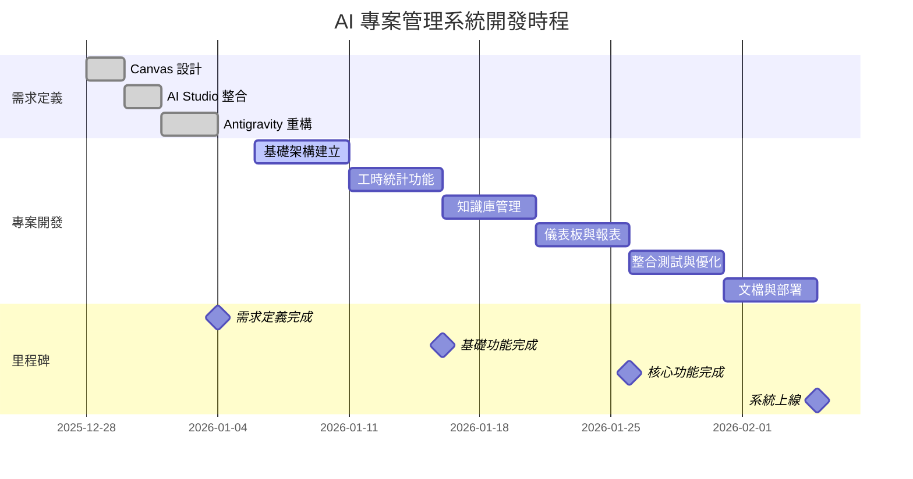

# AI 專案管理系統 - 完整前期規劃文檔

> **專案代號**: AI-PM-System  
> **規劃日期**: 2025-12-28  
> **規劃方法論**: 中心程式開發方法 (CPDM)  
> **文檔版本**: 1.0

---

## 📋 目錄

1. [專案概述](#專案概述)
2. [需求定義階段](#需求定義階段)
3. [系統架構設計](#系統架構設計)
4. [技術棧選型](#技術棧選型)
5. [開發階段規劃](#開發階段規劃)
6. [風險管理計畫](#風險管理計畫)
7. [時程與里程碑](#時程與里程碑)

---

## 📌 專案概述

### 專案背景

基於過去 25 次對話互動、102 小時的開發經驗,以及在「福至心靈籤」、「AI專案管理」、「常春藤尾牙互動遊戲」三個專案中的實踐,我們需要建立一個完整的 **AI 專案管理系統**,以系統化、標準化的方式管理所有 AI 協作開發專案。

### 專案目標

#### 主要目標
1. **建立完整的 CPDM 方法論實踐平台**
   - 支援需求定義階段的完整流程
   - 支援專案開發階段的協作機制
   - 提供進度追蹤與工時分析功能

2. **實現精準的工時審計系統**
   - 自動從對話記錄提取工時資料
   - 支援跨日工時正確分配
   - 提供多維度統計分析

3. **建立知識管理體系**
   - 結構化知識庫管理
   - 技術決策記錄與追蹤
   - 問題解決方案複用

#### 次要目標
- 提升團隊協作效率 70%
- 降低需求誤解率 80%
- 建立可複用的開發模板庫
- 累積企業級 AI 協作經驗

### 專案範圍

#### 包含範圍
✅ **需求定義階段工具**
- Canvas 設計模板管理
- AI Studio 雛型整合
- 架構設計文檔生成

✅ **專案開發階段工具**
- 工程師協作模板
- 進度追蹤儀表板
- 工時統計與分析

✅ **知識管理系統**
- 技術決策記錄
- 問題解決方案庫
- 最佳實踐文檔

✅ **專案管理功能**
- 專案列表與狀態追蹤
- 互動歷史自動生成
- 數據完整性驗證

#### 不包含範圍
❌ 實際的程式碼編輯器
❌ 版本控制系統 (使用現有 Git)
❌ CI/CD 自動化部署
❌ 即時通訊功能

### 成功標準

| 指標 | 目標值 | 衡量方式 |
|------|--------|----------|
| 需求定義完成時間 | ≤ 1 週 | 從開始到驗證通過的天數 |
| 雛型驗證通過率 | ≥ 80% | 驗證項目通過數 / 總項目數 |
| 工時記錄準確度 | ≥ 95% | 自動記錄 vs 手動記錄的誤差 |
| 知識文檔數量 | ≥ 50 篇 | 累積的知識庫文檔數 |
| 用戶滿意度 | ≥ 85% | 問卷調查評分 |

---

## 🎨 需求定義階段

### 步驟 1: 前端人員 Canvas 設計

#### 1.1 資料輸入畫面設計

**專案列表管理介面**

```markdown
## 專案列表輸入畫面

### 基本資料欄位
- 專案名稱: [文字] - 必填
- 專案代號: [文字] - 必填
- 專案狀態: [下拉選單: 規劃中/進行中/已完成/已暫停] - 必填
- 開始日期: [日期選擇器] - 必填
- 預計結束日期: [日期選擇器] - 選填
- 專案描述: [多行文字] - 選填
- 專案路徑: [文字] - 必填

### 檢核條件
- 專案代號必須唯一
- 開始日期不能晚於預計結束日期
- 專案路徑必須是有效的目錄路徑

### 參照資料
- 專案狀態: 預定義選項列表
- 專案路徑: 可瀏覽檔案系統選擇
```

**對話記錄管理介面**

```markdown
## 對話記錄輸入畫面

### 基本資料欄位
- 對話 ID: [文字] - 自動生成
- 對話標題: [文字] - 必填
- 所屬專案: [下拉選單] - 必填
- 分類: [下拉選單: DEBUG/UI調整/資料處理/架構變更/知識收集/其他] - 必填
- 開始時間: [日期時間] - 自動記錄
- 結束時間: [日期時間] - 自動記錄
- 工時: [數字] - 自動計算
- 摘要: [多行文字] - 選填

### 檢核條件
- 對話 ID 必須唯一
- 結束時間必須晚於開始時間
- 工時自動計算,可手動調整
- 所屬專案必須存在於專案列表中

### 參照資料
- 所屬專案: 從專案列表中選擇
- 分類: 預定義分類列表
```

**工時統計查詢介面**

```markdown
## 工時統計查詢畫面

### 查詢條件
- 專案: [多選下拉選單] - 選填
- 分類: [多選下拉選單] - 選填
- 日期範圍: [日期區間選擇器] - 必填
- 工程師: [多選下拉選單] - 選填

### 顯示欄位
- 總工時
- 專案分布圖表
- 分類分布圖表
- 每日工時趨勢圖
- 詳細記錄列表

### 檢核條件
- 日期範圍不能超過 1 年
- 至少選擇一個查詢條件
```

#### 1.2 報表與 BI 需求

**專案進度報表**
- 資料來源: 專案列表、對話記錄
- 統計維度: 專案、時間、狀態
- 呈現方式: 甘特圖、進度條、狀態圓餅圖
- 篩選條件: 專案狀態、日期範圍

**工時分析報表**
- 資料來源: 對話記錄
- 統計維度: 專案、分類、工程師、日期
- 呈現方式: 柱狀圖、折線圖、熱力圖
- 篩選條件: 專案、分類、日期範圍

**知識庫統計報表**
- 資料來源: 知識庫文檔
- 統計維度: 分類、建立時間、更新頻率
- 呈現方式: 樹狀圖、標籤雲
- 篩選條件: 分類、日期範圍

#### 1.3 Canvas 設計交付物

- ✅ 專案列表管理畫面設計
- ✅ 對話記錄管理畫面設計
- ✅ 工時統計查詢畫面設計
- ✅ 知識庫管理畫面設計
- ✅ 儀表板總覽畫面設計
- ✅ 欄位規格文檔
- ✅ 檢核條件清單
- ✅ 參照資料定義

### 步驟 2: 主管 AI Studio 整合

#### 2.1 雛型系統整合

**整合範圍**
1. 專案管理模組
   - 專案列表 CRUD
   - 專案狀態追蹤
   - 專案統計分析

2. 對話記錄模組
   - 對話記錄自動導入
   - 工時自動計算
   - 跨日工時分配

3. 知識庫模組
   - 文檔分類管理
   - 全文搜尋
   - 標籤系統

4. 報表與 BI 模組
   - 專案進度報表
   - 工時分析報表
   - 知識庫統計

**資料流程**


#### 2.2 雛型驗證計畫

**驗證對象**
- 專案經理 (主管角色)
- 前端開發人員
- 後端開發人員
- 系統架構師

**驗證項目**
- [ ] 專案建立流程是否順暢
- [ ] 對話記錄導入是否準確
- [ ] 工時統計是否正確
- [ ] 報表呈現是否清晰
- [ ] 知識庫搜尋是否有效
- [ ] 整體使用體驗是否良好

**驗證標準**
- 滿意度評分 ≥ 4/5
- 關鍵功能通過率 100%
- 使用流程順暢度 ≥ 80%

#### 2.3 AI Studio 整合交付物

- ✅ 整合雛型系統 (可互動)
- ✅ 資料流程圖
- ✅ 報表原型
- ✅ BI 儀表板設計
- ✅ 驗證回饋記錄
- ✅ 調整建議清單

### 步驟 3: 開發者 Antigravity 重構

#### 3.1 資料庫設計

**核心資料表**

```sql
-- 專案表
CREATE TABLE projects (
    id VARCHAR(50) PRIMARY KEY,
    name VARCHAR(200) NOT NULL,
    code VARCHAR(50) UNIQUE NOT NULL,
    status VARCHAR(20) NOT NULL,
    start_date DATE NOT NULL,
    end_date DATE,
    description TEXT,
    path VARCHAR(500) NOT NULL,
    created_at TIMESTAMP DEFAULT CURRENT_TIMESTAMP,
    updated_at TIMESTAMP DEFAULT CURRENT_TIMESTAMP ON UPDATE CURRENT_TIMESTAMP,
    INDEX idx_status (status),
    INDEX idx_start_date (start_date)
);

-- 對話記錄表
CREATE TABLE conversations (
    id VARCHAR(50) PRIMARY KEY,
    title VARCHAR(300) NOT NULL,
    project_id VARCHAR(50) NOT NULL,
    category VARCHAR(50) NOT NULL,
    start_time TIMESTAMP NOT NULL,
    end_time TIMESTAMP NOT NULL,
    hours DECIMAL(10,2) NOT NULL,
    summary TEXT,
    file_size_kb DECIMAL(10,2),
    created_at TIMESTAMP DEFAULT CURRENT_TIMESTAMP,
    FOREIGN KEY (project_id) REFERENCES projects(id),
    INDEX idx_project_id (project_id),
    INDEX idx_category (category),
    INDEX idx_start_time (start_time)
);

-- 每日工時表 (支援跨日分配)
CREATE TABLE daily_hours (
    id INT AUTO_INCREMENT PRIMARY KEY,
    conversation_id VARCHAR(50) NOT NULL,
    work_date DATE NOT NULL,
    hours DECIMAL(10,2) NOT NULL,
    created_at TIMESTAMP DEFAULT CURRENT_TIMESTAMP,
    FOREIGN KEY (conversation_id) REFERENCES conversations(id),
    INDEX idx_conversation_id (conversation_id),
    INDEX idx_work_date (work_date),
    UNIQUE KEY uk_conv_date (conversation_id, work_date)
);

-- 知識文檔表
CREATE TABLE knowledge_docs (
    id INT AUTO_INCREMENT PRIMARY KEY,
    title VARCHAR(300) NOT NULL,
    category VARCHAR(100) NOT NULL,
    subcategory VARCHAR(100),
    content TEXT NOT NULL,
    tags JSON,
    file_path VARCHAR(500) NOT NULL,
    created_at TIMESTAMP DEFAULT CURRENT_TIMESTAMP,
    updated_at TIMESTAMP DEFAULT CURRENT_TIMESTAMP ON UPDATE CURRENT_TIMESTAMP,
    INDEX idx_category (category),
    INDEX idx_created_at (created_at),
    FULLTEXT idx_content (title, content)
);

-- Artifacts 表
CREATE TABLE artifacts (
    id INT AUTO_INCREMENT PRIMARY KEY,
    conversation_id VARCHAR(50) NOT NULL,
    name VARCHAR(200) NOT NULL,
    type VARCHAR(50) NOT NULL,
    file_path VARCHAR(500) NOT NULL,
    created_at TIMESTAMP DEFAULT CURRENT_TIMESTAMP,
    FOREIGN KEY (conversation_id) REFERENCES conversations(id),
    INDEX idx_conversation_id (conversation_id),
    INDEX idx_type (type)
);
```

**ER Diagram**



#### 3.2 系統架構設計

**整體架構**



**技術架構分層**

1. **展示層 (Presentation Layer)**
   - 技術: HTML5 + Vanilla CSS + JavaScript
   - 職責: 使用者介面呈現與互動
   - 特點: 無框架依賴,輕量化

2. **業務邏輯層 (Business Logic Layer)**
   - 技術: JavaScript (ES6+)
   - 職責: 業務規則、資料驗證、流程控制
   - 模組:
     - ProjectService: 專案管理邏輯
     - ConversationService: 對話記錄處理
     - KnowledgeService: 知識庫管理
     - StatisticsService: 統計分析

3. **資料存取層 (Data Access Layer)**
   - 技術: 本地 JSON 檔案 + IndexedDB
   - 職責: 資料 CRUD 操作
   - 特點: 離線優先,無需後端伺服器

4. **資料層 (Data Layer)**
   - 主要儲存: JSON 檔案
   - 輔助儲存: IndexedDB (快取與索引)
   - 檔案系統: Markdown 文檔、對話記錄

#### 3.3 API 設計

由於採用純前端架構,API 設計為內部 JavaScript 模組介面:

**專案管理 API**

```javascript
// ProjectService.js
class ProjectService {
    // 建立專案
    async createProject(projectData) { }
    
    // 取得專案列表
    async getProjects(filter = {}) { }
    
    // 取得單一專案
    async getProject(projectId) { }
    
    // 更新專案
    async updateProject(projectId, updates) { }
    
    // 刪除專案
    async deleteProject(projectId) { }
    
    // 取得專案統計
    async getProjectStats(projectId) { }
}
```

**對話記錄 API**

```javascript
// ConversationService.js
class ConversationService {
    // 導入對話記錄
    async importConversations(jsonData) { }
    
    // 取得對話列表
    async getConversations(filter = {}) { }
    
    // 取得單一對話
    async getConversation(conversationId) { }
    
    // 計算工時
    async calculateHours(startTime, endTime) { }
    
    // 分配跨日工時
    async splitCrossDayHours(conversation) { }
    
    // 取得每日工時
    async getDailyHours(dateRange) { }
}
```

**知識庫 API**

```javascript
// KnowledgeService.js
class KnowledgeService {
    // 建立知識文檔
    async createDocument(docData) { }
    
    // 搜尋文檔
    async searchDocuments(query, filters = {}) { }
    
    // 取得文檔
    async getDocument(docId) { }
    
    // 更新文檔
    async updateDocument(docId, updates) { }
    
    // 刪除文檔
    async deleteDocument(docId) { }
    
    // 取得標籤雲
    async getTagCloud() { }
}
```

**統計分析 API**

```javascript
// StatisticsService.js
class StatisticsService {
    // 取得專案統計
    async getProjectStatistics(projectId, dateRange) { }
    
    // 取得工時統計
    async getHourStatistics(filters) { }
    
    // 取得分類統計
    async getCategoryStatistics(projectId) { }
    
    // 取得趨勢分析
    async getTrendAnalysis(metric, dateRange) { }
    
    // 產生報表
    async generateReport(reportType, params) { }
}
```

#### 3.4 前後端整合規劃

**專案結構**

```
AI專案管理/
├── index.html                      # 主頁面
├── ProjectDashboard.html           # 專案儀表板
├── InteractionHistoryGenerator.html # 互動歷史產生器
├── css/
│   ├── main.css                    # 主樣式
│   ├── dashboard.css               # 儀表板樣式
│   └── components.css              # 元件樣式
├── js/
│   ├── services/
│   │   ├── ProjectService.js       # 專案服務
│   │   ├── ConversationService.js  # 對話服務
│   │   ├── KnowledgeService.js     # 知識服務
│   │   └── StatisticsService.js    # 統計服務
│   ├── utils/
│   │   ├── dateUtils.js            # 日期工具
│   │   ├── chartUtils.js           # 圖表工具
│   │   └── fileUtils.js            # 檔案工具
│   └── components/
│       ├── ProjectList.js          # 專案列表元件
│       ├── ConversationList.js     # 對話列表元件
│       └── StatisticsChart.js      # 統計圖表元件
├── data/
│   ├── projects.json               # 專案資料
│   ├── conversations.json          # 對話記錄
│   └── knowledge_index.json        # 知識庫索引
├── chat_logs/                      # 對話記錄檔案
├── 知識庫/                         # 知識文檔
└── 模板/                           # 文檔模板
```

**資料流程**



#### 3.5 開發者重構交付物

- ✅ 資料庫 Schema (JSON 資料結構)
- ✅ ER Diagram
- ✅ 系統架構圖
- ✅ API 規格文檔
- ✅ 前端專案結構
- ✅ 資料流程圖
- ✅ 技術棧定義文檔

---

## 🛠️ 技術棧選型

### 前端技術

| 技術 | 版本 | 用途 | 選擇理由 |
|------|------|------|----------|
| HTML5 | - | 頁面結構 | 標準、穩定、無依賴 |
| CSS3 | - | 樣式設計 | 原生支援、效能最佳 |
| JavaScript | ES6+ | 業務邏輯 | 現代語法、瀏覽器原生支援 |
| Chart.js | 4.x | 圖表繪製 | 輕量、易用、功能完整 |

### 資料儲存

| 技術 | 用途 | 選擇理由 |
|------|------|----------|
| JSON 檔案 | 主要資料儲存 | 可讀性高、易於版本控制、無需資料庫 |
| IndexedDB | 快取與索引 | 瀏覽器原生、支援大量資料、離線可用 |
| LocalStorage | 使用者偏好設定 | 簡單、快速、持久化 |

### 開發工具

| 工具 | 用途 |
|------|------|
| VS Code | 程式碼編輯 |
| Git | 版本控制 |
| GitHub | 程式碼託管 |
| Chrome DevTools | 除錯與效能分析 |

### 文檔工具

| 工具 | 用途 |
|------|------|
| Markdown | 文檔撰寫 |
| Mermaid | 圖表繪製 |
| NotebookLM | 知識分析 |

### 技術選型原則

1. **簡單優先**: 優先選擇簡單、穩定的技術
2. **無依賴**: 盡量減少外部依賴
3. **離線優先**: 支援離線使用
4. **易於維護**: 技術棧清晰,易於理解和維護
5. **效能優先**: 注重載入速度和執行效能

---

## 📅 開發階段規劃

### 階段一: 基礎架構建立 (Week 1)

**目標**: 建立專案基礎架構和核心資料模型

**任務清單**:
- [ ] 建立專案目錄結構
- [ ] 設計 JSON 資料格式
- [ ] 實作 ProjectService 核心功能
- [ ] 實作 ConversationService 核心功能
- [ ] 建立基礎 UI 框架

**交付物**:
- 專案結構文檔
- 資料格式規範
- 核心服務模組
- 基礎 UI 頁面

**驗收標準**:
- 可建立和讀取專案資料
- 可導入對話記錄
- 基礎 UI 可正常顯示

### 階段二: 工時統計功能 (Week 2)

**目標**: 實作精準的工時統計與分析功能

**任務清單**:
- [ ] 實作工時計算邏輯
- [ ] 實作跨日工時分配演算法
- [ ] 建立每日工時統計
- [ ] 實作工時分析報表
- [ ] 建立工時視覺化圖表

**交付物**:
- 工時計算模組
- 跨日分配演算法
- 工時統計報表
- 視覺化圖表

**驗收標準**:
- 工時計算準確度 ≥ 95%
- 跨日分配邏輯正確
- 報表資料完整無誤

### 階段三: 知識庫管理 (Week 3)

**目標**: 建立完整的知識庫管理系統

**任務清單**:
- [ ] 實作 KnowledgeService
- [ ] 建立文檔分類系統
- [ ] 實作全文搜尋功能
- [ ] 建立標籤系統
- [ ] 實作知識庫 UI

**交付物**:
- 知識服務模組
- 分類與標籤系統
- 搜尋功能
- 知識庫管理介面

**驗收標準**:
- 可建立、編輯、刪除文檔
- 搜尋功能準確有效
- 分類與標籤正確運作

### 階段四: 儀表板與報表 (Week 4)

**目標**: 建立完整的儀表板和報表系統

**任務清單**:
- [ ] 實作 StatisticsService
- [ ] 建立專案進度儀表板
- [ ] 建立工時分析儀表板
- [ ] 實作多維度報表
- [ ] 優化視覺化呈現

**交付物**:
- 統計服務模組
- 專案儀表板
- 工時儀表板
- 多維度報表

**驗收標準**:
- 儀表板資料即時更新
- 報表資料準確完整
- 視覺化清晰易懂

### 階段五: 整合測試與優化 (Week 5)

**目標**: 整合所有模組並進行全面測試

**任務清單**:
- [ ] 整合所有功能模組
- [ ] 進行功能測試
- [ ] 進行效能測試
- [ ] 修復發現的問題
- [ ] 優化使用者體驗

**交付物**:
- 整合測試報告
- 效能測試報告
- 問題修復記錄
- 優化建議清單

**驗收標準**:
- 所有功能正常運作
- 效能符合要求
- 無重大 Bug

### 階段六: 文檔與部署 (Week 6)

**目標**: 完成所有文檔並準備部署

**任務清單**:
- [ ] 撰寫使用者手冊
- [ ] 撰寫開發者文檔
- [ ] 建立部署指南
- [ ] 準備培訓材料
- [ ] 正式部署上線

**交付物**:
- 使用者手冊
- 開發者文檔
- 部署指南
- 培訓材料

**驗收標準**:
- 文檔完整清晰
- 部署流程順暢
- 使用者可自行上手

---

## ⚠️ 風險管理計畫

### 風險識別矩陣

| 風險 | 機率 | 影響 | 等級 | 負責人 | 應對策略 |
|------|------|------|------|--------|----------|
| 跨日工時計算邏輯複雜 | 🟡 中 | 🔴 高 | 🔴 高 | 開發者 | 提前進行演算法驗證 |
| 資料格式不一致 | 🟡 中 | 🟡 中 | 🟡 中 | 開發者 | 建立嚴格的資料驗證 |
| 效能問題 (大量資料) | 🟢 低 | 🟡 中 | 🟢 低 | 開發者 | 使用 IndexedDB 快取 |
| 使用者體驗不佳 | 🟡 中 | 🟡 中 | 🟡 中 | UI 設計師 | 進行使用者測試 |
| 知識庫搜尋效能 | 🟢 低 | 🟡 中 | 🟢 低 | 開發者 | 建立索引機制 |

### 風險應對計畫

#### 風險 1: 跨日工時計算邏輯複雜

**預防措施**:
- ✅ 提前設計演算法並進行數學驗證
- ✅ 建立完整的測試案例
- ✅ 參考現有的 Dashboard 實作經驗

**應對方案**:
1. 建立獨立的工時計算模組
2. 進行單元測試驗證
3. 使用真實資料進行整合測試
4. 必要時簡化邏輯,確保準確性

**監控指標**:
- 計算準確度
- 邊界案例處理
- 效能表現

#### 風險 2: 資料格式不一致

**預防措施**:
- ✅ 定義嚴格的 JSON Schema
- ✅ 實作資料驗證機制
- ✅ 提供資料格式轉換工具

**應對方案**:
1. 在導入時進行格式驗證
2. 提供詳細的錯誤訊息
3. 支援多種資料格式
4. 建立資料修復工具

**監控指標**:
- 導入成功率
- 資料驗證通過率
- 錯誤類型分布

#### 風險 3: 效能問題

**預防措施**:
- ✅ 使用 IndexedDB 進行資料快取
- ✅ 實作分頁載入機制
- ✅ 優化資料查詢演算法

**應對方案**:
1. 進行效能測試
2. 識別效能瓶頸
3. 優化關鍵路徑
4. 必要時進行資料分片

**監控指標**:
- 頁面載入時間
- 查詢回應時間
- 記憶體使用量

---

## 📆 時程與里程碑

### 整體時程規劃



### 里程碑定義

#### 里程碑 1: 需求定義完成 (2026-01-05)

**完成標準**:
- ✅ Canvas 設計文檔完成
- ✅ 雛型系統驗證通過 (滿意度 ≥ 80%)
- ✅ 系統架構設計完成
- ✅ 技術棧選型確定

**交付物**:
- Canvas 設計文檔
- 雛型系統
- 系統架構文檔
- 資料庫 Schema
- API 規格文檔

#### 里程碑 2: 基礎功能完成 (2026-01-17)

**完成標準**:
- ✅ 專案管理功能可用
- ✅ 對話記錄導入功能可用
- ✅ 工時統計功能可用
- ✅ 基礎 UI 完成

**交付物**:
- 專案管理模組
- 對話記錄模組
- 工時統計模組
- 基礎 UI 頁面

#### 里程碑 3: 核心功能完成 (2026-01-31)

**完成標準**:
- ✅ 知識庫管理功能完成
- ✅ 儀表板功能完成
- ✅ 報表功能完成
- ✅ 所有核心功能整合完成

**交付物**:
- 知識庫模組
- 儀表板頁面
- 報表系統
- 整合測試報告

#### 里程碑 4: 系統上線 (2026-02-14)

**完成標準**:
- ✅ 所有功能測試通過
- ✅ 效能測試通過
- ✅ 文檔完成
- ✅ 使用者培訓完成
- ✅ 正式部署上線

**交付物**:
- 完整系統
- 使用者手冊
- 開發者文檔
- 部署指南
- 培訓材料

### 每週檢查點

**每週五下午 3:00 - 進度檢查會議**

**議程**:
1. 本週完成項目回顧 (20 分鐘)
2. 下週計畫確認 (15 分鐘)
3. 問題與風險討論 (15 分鐘)
4. 行動項目確認 (10 分鐘)

**產出**:
- 週進度報告
- 問題清單
- 行動項目清單

---

## 📊 成效評估指標

### 專案級指標

| 指標 | 目標值 | 當前值 | 達成率 | 狀態 |
|------|--------|--------|--------|------|
| 需求定義時間 | ≤ 1 週 | - | - | 🔵 規劃中 |
| 雛型驗證通過率 | ≥ 80% | - | - | 🔵 規劃中 |
| 開發準時率 | ≥ 90% | - | - | 🔵 規劃中 |
| 功能完成度 | 100% | - | - | 🔵 規劃中 |
| 用戶滿意度 | ≥ 85% | - | - | 🔵 規劃中 |

### 品質指標

| 指標 | 目標值 | 衡量方式 |
|------|--------|----------|
| 工時計算準確度 | ≥ 95% | 自動計算 vs 手動驗證 |
| 資料導入成功率 | ≥ 98% | 成功筆數 / 總筆數 |
| 系統回應時間 | ≤ 2 秒 | 平均查詢回應時間 |
| Bug 數量 | ≤ 10 個 | 測試階段發現的 Bug 數 |
| 程式碼覆蓋率 | ≥ 80% | 測試覆蓋的程式碼比例 |

---

## 📝 附錄

### A. 參考文檔

- [中心程式開發方法 (CPDM)](file:///c:/Users/Arthur8888tw/Documents/Html/新增資料夾/AI專案管理/工作流程/中心程式開發方法.md)
- [Gemini 驅動開發方法論](file:///c:/Users/Arthur8888tw/Documents/Html/新增資料夾/AI專案管理/工作流程/Gemini驅動開發方法論.md)
- [對話驅動開發指南](file:///c:/Users/Arthur8888tw/Documents/Html/新增資料夾/AI專案管理/工作流程/對話驅動開發指南.md)
- [專案互動歷史報告](file:///c:/Users/Arthur8888tw/Documents/Html/新增資料夾/AI專案管理/project_interaction_history_auto.md)

### B. 相關模板

- [前端 Canvas 設計模板](file:///c:/Users/Arthur8888tw/Documents/Html/新增資料夾/AI專案管理/模板/CPDM模板/前端Canvas設計模板.md)
- [主管 AI Studio 整合模板](file:///c:/Users/Arthur8888tw/Documents/Html/新增資料夾/AI專案管理/模板/CPDM模板/主管AIStudio整合模板.md)
- [系統架構設計指南](file:///c:/Users/Arthur8888tw/Documents/Html/新增資料夾/AI專案管理/模板/CPDM模板/系統架構設計指南.md)

### C. 專案資源

- 專案路徑: `c:\Users\Arthur8888tw\Documents\Html\新增資料夾\AI專案管理`
- 對話記錄: `chat_logs/`
- 知識庫: `知識庫/`
- 模板: `模板/`

---

**文檔狀態**: ✅ 已完成  
**審核狀態**: 🔵 待審核  
**版本**: 1.0  
**建立日期**: 2025-12-28  
**最後更新**: 2025-12-28  
**建立者**: AI 專案管理團隊  
**審核者**: 待指定
