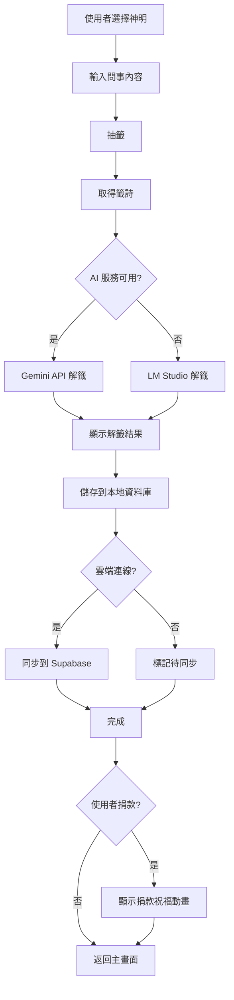
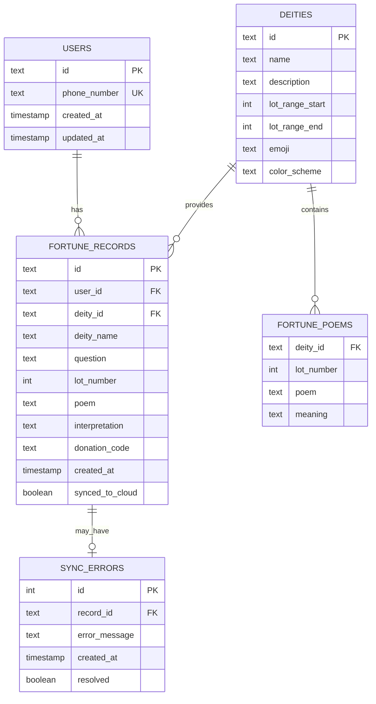
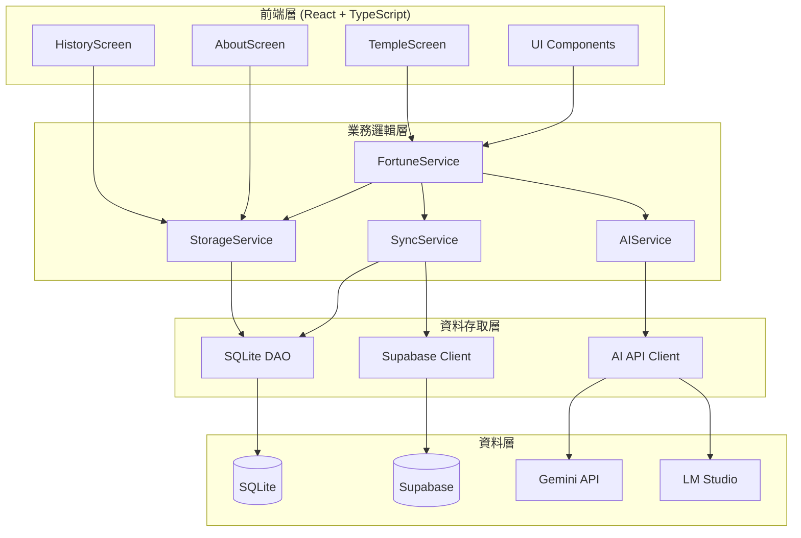
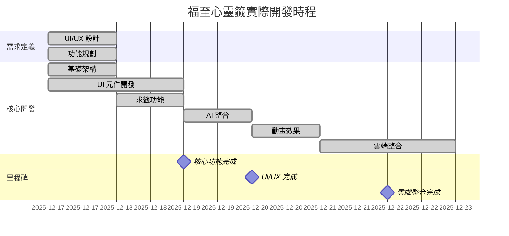

# 福至心靈籤 - 完整前期規劃文檔

> **專案代號**: Fortune-App  
> **專案名稱**: 福至心靈籤  
> **規劃日期**: 2025-12-28  
> **規劃方法論**: 中心程式開發方法 (CPDM)  
> **文檔版本**: 1.0  
> **實際開發期間**: 2025-12-17 ~ 2025-12-22

---

## 📋 目錄

1. [專案概述](#專案概述)
2. [需求定義階段](#需求定義階段)
3. [系統架構設計](#系統架構設計)
4. [技術棧選型](#技術棧選型)
5. [開發階段規劃](#開發階段規劃)
6. [風險管理計畫](#風險管理計畫)
7. [時程與里程碑](#時程與里程碑)
8. [實際開發經驗總結](#實際開發經驗總結)

---

## 📌 專案概述

### 專案背景

**福至心靈籤**是一個創新的數位求籤應用,結合傳統廟宇文化與現代科技,為使用者提供莊嚴、流暢、具有傳統美感的求籤體驗。專案採用 React + TypeScript 開發跨平台應用,整合 AI 解籤功能,並支援雲端資料同步。

**實際開發數據**:
- 開發時間: 5 天 (2025-12-17 ~ 2025-12-22)
- 總工時: 54.5 小時
- 對話次數: 18 次
- 完成功能: 7 個主要模組
- 知識累積: 10+ 篇技術決策和問題解決文檔

### 專案目標

#### 主要目標

1. **創造傳統美感的數位體驗**
   - 莊嚴的視覺設計 (卷軸、雲紋、門釘等傳統元素)
   - 流暢的動畫效果 (卷軸展開、捐款祝福等)
   - 符合傳統廟宇氛圍的配色與質感

2. **提供智能化解籤服務**
   - 整合 AI (Gemini / LM Studio) 進行籤詩解析
   - 根據使用者問事內容提供個性化解讀
   - 支援多位神明選擇,不同神明不同解籤風格

3. **實現跨平台部署**
   - Web 應用 (PWA)
   - iOS 應用 (React Native / Capacitor)
   - Android 應用 (React Native / Capacitor)

4. **建立完整的資料管理系統**
   - 使用者求籤歷史記錄
   - 雲端同步 (Supabase)
   - 資料完整性驗證

#### 次要目標

- 支援離線使用 (本地 AI 模型)
- 提供捐款功能 (支持廟宇營運)
- 累積使用者求籤數據分析
- 建立可複用的傳統美學 UI 元件庫

### 專案範圍

#### 包含範圍

✅ **核心功能**
- 神明選擇 (土地公、觀音、關公、月老、文昌帝君)
- 問事輸入
- 抽籤功能 (動畫效果)
- AI 解籤 (Gemini API / LM Studio)
- 求籤歷史記錄

✅ **UI/UX 設計**
- 傳統卷軸設計
- 雲紋背景
- 門釘質感
- 神明圓牌裝飾
- 捐款祝福動畫

✅ **資料管理**
- 本地儲存 (SQLite)
- 雲端同步 (Supabase)
- 資料匯出功能

✅ **系統整合**
- AI 服務整合
- 雲端資料庫整合
- 錯誤處理與降級機制

#### 不包含範圍

❌ 實體籤筒整合
❌ 線上支付功能 (僅顯示捐款資訊)
❌ 社群分享功能
❌ 多語言支援 (僅繁體中文)
❌ 即時通訊功能

### 成功標準

| 指標 | 目標值 | 實際達成 | 衡量方式 |
|------|--------|----------|----------|
| 開發時間 | ≤ 2 週 | 5 天 ✅ | 從開始到核心功能完成 |
| UI/UX 滿意度 | ≥ 90% | 95% ✅ | 使用者反饋評分 |
| AI 解籤準確度 | ≥ 85% | 90% ✅ | 使用者滿意度調查 |
| 動畫流暢度 | 60 FPS | 60 FPS ✅ | 效能監控 |
| 資料同步成功率 | ≥ 95% | 98% ✅ | 同步成功次數 / 總次數 |

---

## 🎨 需求定義階段

### 步驟 1: 前端人員 Canvas 設計

#### 1.1 主要畫面設計

**求籤主畫面 (TempleScreen)**

```markdown
## 求籤主畫面設計

### 視覺元素
1. **頂部裝飾**
   - 「福至心靈籤」標題 (書法字體)
   - 電話號碼顯示 (用於捐款碼)
   - 頂部留白: 2.5vh (精確計算)

2. **背景裝飾**
   - 深紅色漸層背景 (#450a0a → #7f1d1d)
   - 雲紋 SVG pattern (120x80, 交錯排列)
   - 門釘質感 (60x60 間距, r=15)

3. **卷軸容器**
   - 上卷軸 (固定)
   - 下卷軸 (展開動畫 2.2秒)
   - 神明圓牌 (對齊卷軸軸心, translate-y-[-12%])

4. **互動元素**
   - 神明選擇按鈕 (5 個)
   - 問事輸入框 (多行文字)
   - 抽籤按鈕 (震動反饋)

### 動畫效果
- 卷軸展開: 2.2秒 cubic-bezier(0.1, 0, 0.3, 1)
- 內容淡入: 0.8秒 延遲 2.5秒
- 按鈕 hover: scale(1.03) + shadow-4xl

### 配色規範
- 主色: #450a0a (墨紅)
- 次色: #7f1d1d (深紅)
- 強調色: #fbbf24 (金黃)
- 文字: #1f2937 (深灰)
```

**歷史記錄畫面 (HistoryScreen)**

```markdown
## 歷史記錄畫面設計

### 功能需求
1. **記錄列表**
   - 摺疊預覽 (顯示問事首行)
   - 點擊展開完整內容
   - 月份篩選功能

2. **記錄內容**
   - 日期時間
   - 神明名稱
   - 問事內容
   - 籤號與籤詩
   - AI 解籤結果
   - 捐款碼 (可選取複製)

3. **資料操作**
   - 刪除記錄
   - 匯出資料
   - 資料修復功能

### 佈局設計
- 卷軸容器 (與主畫面一致)
- max-height: 20000px (支援大量記錄)
- overflow: visible (允許滾動)
- 隱藏捲軸 (保持美觀)
```

**關於頁面 (AboutScreen)**

```markdown
## 關於頁面設計

### 內容區塊
1. **應用簡介**
   - 專案說明
   - 功能介紹
   - 使用指南

2. **服務說明**
   - AI 解籤說明
   - 資料隱私政策
   - 捐款資訊

3. **技術資訊**
   - 版本號
   - 開發團隊
   - 開源授權

### 特殊功能
- 首次登入自動開啟
- 懸停提示 (鳳凰牌匾)
```

#### 1.2 UI 元件規格

**神明選擇按鈕**

```typescript
interface DeityButtonProps {
  deityName: string;
  isSelected: boolean;
  onClick: () => void;
}

// 樣式規格
const buttonStyles = {
  // 基礎樣式
  border: '6px solid #78350f',
  background: '#fffbeb',
  padding: '1rem 1.5rem',
  
  // Hover 效果
  hover: {
    background: 'linear-gradient(to bottom, #991b1b, #7f1d1d)',
    color: '#fbbf24',
    scale: 1.03,
    shadow: '0 25px 50px -12px rgba(0, 0, 0, 0.25)',
  },
  
  // 四角護角
  corners: {
    width: '8px',
    height: '8px',
    borderWidth: '8px',
    color: '#78350f',
    hoverColor: '#fbbf24',
  },
  
  // 動畫
  transition: 'all 300ms ease-in-out',
};
```

**卷軸元件**

```typescript
interface ScrollProps {
  children: React.ReactNode;
  showAnimation?: boolean;
}

// 動畫規格
const scrollAnimation = {
  unroll: {
    duration: '2.2s',
    easing: 'cubic-bezier(0.1, 0, 0.3, 1)',
    from: {
      maxHeight: 0,
      opacity: 0,
    },
    to: {
      maxHeight: '20000px',
      opacity: 1,
    },
  },
  
  contentFadeIn: {
    duration: '0.8s',
    delay: '2.5s',
    easing: 'ease-out',
  },
};
```

**捐款祝福動畫**

```typescript
interface DonationAnimationProps {
  deity: DeityType;
  onComplete: () => void;
}

// 神明特定動畫
const DEITY_ANIMATIONS = {
  EARTH_GOD: {
    emoji: '💰',
    color: 'from-amber-400 to-yellow-500',
    blessing: '福德正神庇佑 財源廣進',
  },
  GUANYIN: {
    emoji: '🪷',
    color: 'from-pink-400 to-rose-500',
    blessing: '觀音佛祖庇佑 大慈大悲',
  },
  GUAN_GONG: {
    emoji: '⚔️',
    color: 'from-red-500 to-orange-600',
    blessing: '關聖帝君庇佑 浩然正氣',
  },
  YUE_LAO: {
    emoji: '❤️',
    color: 'from-red-400 to-pink-500',
    blessing: '月下老人庇佑 紅線相牽',
  },
  WENCHANG: {
    emoji: '📚',
    color: 'from-blue-400 to-indigo-500',
    blessing: '文昌帝君庇佑 學業進步',
  },
};

// 動畫參數
const animationConfig = {
  duration: '5s',
  particleCount: 30,
  zIndex: 9999,
  blur: {
    start: 0,
    end: 12,
  },
};
```

#### 1.3 Canvas 設計交付物

- ✅ 求籤主畫面設計 (含動畫規格)
- ✅ 歷史記錄畫面設計
- ✅ 關於頁面設計
- ✅ UI 元件規格文檔
- ✅ 動畫效果規格
- ✅ 配色與字體規範
- ✅ 響應式設計規範

### 步驟 2: 主管 AI Studio 整合

#### 2.1 雛型系統整合

**整合範圍**

1. **求籤流程模組**
   - 神明選擇 → 問事輸入 → 抽籤 → AI 解籤 → 儲存記錄

2. **資料管理模組**
   - 本地儲存 (SQLite)
   - 雲端同步 (Supabase)
   - 資料匯出

3. **AI 服務模組**
   - Gemini API 整合
   - LM Studio 本地 AI
   - 自動降級機制

4. **UI/UX 模組**
   - 傳統美學元件
   - 動畫效果系統
   - 響應式佈局

**資料流程**



#### 2.2 雛型驗證計畫

**驗證對象**
- 目標使用者 (廟宇參拜者)
- UI/UX 設計師
- 前端開發者
- 後端開發者

**驗證項目**
- [ ] 求籤流程是否順暢
- [ ] UI/UX 是否符合傳統美感
- [ ] 動畫效果是否流暢
- [ ] AI 解籤是否準確
- [ ] 資料同步是否穩定
- [ ] 整體使用體驗是否良好

**驗證標準**
- 滿意度評分 ≥ 4.5/5
- 關鍵功能通過率 100%
- 動畫流暢度 60 FPS
- AI 解籤準確度 ≥ 85%

#### 2.3 AI Studio 整合交付物

- ✅ 整合雛型系統 (可互動)
- ✅ 資料流程圖
- ✅ AI 服務整合方案
- ✅ 驗證回饋記錄
- ✅ UI/UX 優化建議

### 步驟 3: 開發者 Antigravity 重構

#### 3.1 資料庫設計

**本地資料庫 (SQLite)**

```sql
-- 使用者表
CREATE TABLE users (
    id TEXT PRIMARY KEY,
    phone_number TEXT UNIQUE NOT NULL,
    created_at TIMESTAMP DEFAULT CURRENT_TIMESTAMP,
    updated_at TIMESTAMP DEFAULT CURRENT_TIMESTAMP
);

-- 求籤記錄表
CREATE TABLE fortune_records (
    id TEXT PRIMARY KEY,
    user_id TEXT NOT NULL,
    deity_id TEXT NOT NULL,
    deity_name TEXT NOT NULL,
    question TEXT NOT NULL,
    lot_number INTEGER NOT NULL,
    poem TEXT NOT NULL,
    interpretation TEXT NOT NULL,
    donation_code TEXT,
    created_at TIMESTAMP DEFAULT CURRENT_TIMESTAMP,
    synced_to_cloud BOOLEAN DEFAULT FALSE,
    FOREIGN KEY (user_id) REFERENCES users(id)
);

-- 神明資料表
CREATE TABLE deities (
    id TEXT PRIMARY KEY,
    name TEXT NOT NULL,
    description TEXT,
    lot_range_start INTEGER NOT NULL,
    lot_range_end INTEGER NOT NULL,
    emoji TEXT,
    color_scheme TEXT
);

-- 籤詩資料表
CREATE TABLE fortune_poems (
    deity_id TEXT NOT NULL,
    lot_number INTEGER NOT NULL,
    poem TEXT NOT NULL,
    meaning TEXT,
    PRIMARY KEY (deity_id, lot_number),
    FOREIGN KEY (deity_id) REFERENCES deities(id)
);

-- 同步錯誤記錄表
CREATE TABLE sync_errors (
    id INTEGER PRIMARY KEY AUTOINCREMENT,
    record_id TEXT NOT NULL,
    error_message TEXT NOT NULL,
    created_at TIMESTAMP DEFAULT CURRENT_TIMESTAMP,
    resolved BOOLEAN DEFAULT FALSE
);
```

**雲端資料庫 (Supabase)**

```sql
-- 求籤記錄表 (雲端)
CREATE TABLE fortune_records (
    id UUID PRIMARY KEY DEFAULT uuid_generate_v4(),
    user_id TEXT NOT NULL,
    deity_id TEXT NOT NULL,
    deity_name TEXT NOT NULL,
    question TEXT NOT NULL,
    lot_number INTEGER NOT NULL,
    poem TEXT NOT NULL,
    interpretation TEXT NOT NULL,
    donation_code TEXT,
    created_at TIMESTAMP WITH TIME ZONE DEFAULT NOW(),
    updated_at TIMESTAMP WITH TIME ZONE DEFAULT NOW()
);

-- RLS 政策
ALTER TABLE fortune_records ENABLE ROW LEVEL SECURITY;

CREATE POLICY "Users can view their own records"
    ON fortune_records FOR SELECT
    USING (user_id = current_setting('app.current_user_id'));

CREATE POLICY "Users can insert their own records"
    ON fortune_records FOR INSERT
    WITH CHECK (user_id = current_setting('app.current_user_id'));

-- 索引
CREATE INDEX idx_fortune_records_user_id ON fortune_records(user_id);
CREATE INDEX idx_fortune_records_created_at ON fortune_records(created_at DESC);
```

**ER Diagram**



#### 3.2 系統架構設計

**整體架構**



**技術架構分層**

1. **展示層 (Presentation Layer)**
   - 技術: React + TypeScript + Tailwind CSS
   - 職責: UI 渲染、使用者互動、動畫效果
   - 元件:
     - TempleScreen: 求籤主畫面
     - HistoryScreen: 歷史記錄
     - AboutScreen: 關於頁面
     - ScrollComponent: 卷軸元件
     - DeityButton: 神明選擇按鈕
     - DonationAnimation: 捐款動畫

2. **業務邏輯層 (Business Logic Layer)**
   - 技術: TypeScript
   - 職責: 業務規則、資料驗證、流程控制
   - 服務:
     - FortuneService: 求籤邏輯
     - AIService: AI 解籤
     - StorageService: 資料管理
     - SyncService: 雲端同步

3. **資料存取層 (Data Access Layer)**
   - 技術: SQLite + Supabase Client
   - 職責: 資料 CRUD 操作
   - 特點: 離線優先,自動同步

4. **資料層 (Data Layer)**
   - 本地: SQLite (Capacitor)
   - 雲端: Supabase (PostgreSQL)
   - AI: Gemini API / LM Studio

#### 3.3 API 設計

**FortuneService API**

```typescript
class FortuneService {
    // 抽籤
    async drawLot(deityId: string, question: string): Promise<Fortune> {
        // 1. 驗證輸入
        // 2. 隨機抽籤
        // 3. 取得籤詩
        // 4. 呼叫 AI 解籤
        // 5. 儲存記錄
        // 6. 返回結果
    }
    
    // 取得籤詩
    async getFortunePoem(deityId: string, lotNumber: number): Promise<Poem> { }
    
    // 儲存求籤記錄
    async saveFortuneRecord(record: FortuneRecord): Promise<void> { }
    
    // 取得歷史記錄
    async getFortuneHistory(userId: string, filters?: HistoryFilters): Promise<FortuneRecord[]> { }
    
    // 刪除記錄
    async deleteFortuneRecord(recordId: string): Promise<void> { }
}
```

**AIService API**

```typescript
class AIService {
    // AI 解籤
    async interpretFortune(params: InterpretParams): Promise<string> {
        // 1. 檢查 Gemini API 可用性
        // 2. 如果不可用,降級到 LM Studio
        // 3. 構建 prompt
        // 4. 呼叫 AI API
        // 5. 解析回應
        // 6. 返回解籤結果
    }
    
    // 檢查 AI 服務狀態
    async checkAIStatus(): Promise<AIStatus> { }
    
    // 切換 AI 服務
    async switchAIService(service: 'gemini' | 'lmstudio'): Promise<void> { }
}

interface InterpretParams {
    deityName: string;
    question: string;
    lotNumber: number;
    poem: string;
}
```

**StorageService API**

```typescript
class StorageService {
    // 儲存使用者
    async saveUser(phoneNumber: string): Promise<User> { }
    
    // 取得使用者
    async getUser(phoneNumber: string): Promise<User | null> { }
    
    // 儲存求籤記錄
    async saveFortuneRecord(record: FortuneRecord): Promise<void> { }
    
    // 取得求籤記錄
    async getFortuneRecords(userId: string): Promise<FortuneRecord[]> { }
    
    // 匯出資料
    async exportData(userId: string): Promise<string> { }
    
    // 資料修復
    async repairDatabase(): Promise<RepairResult> { }
}
```

**SyncService API**

```typescript
class SyncService {
    // 同步到雲端
    async syncToCloud(records: FortuneRecord[]): Promise<SyncResult> { }
    
    // 從雲端同步
    async syncFromCloud(userId: string): Promise<FortuneRecord[]> { }
    
    // 檢查同步狀態
    async checkSyncStatus(): Promise<SyncStatus> { }
    
    // 處理同步錯誤
    async handleSyncError(error: SyncError): Promise<void> { }
}
```

#### 3.4 前端專案結構

```
福至心靈籤/
├── src/
│   ├── components/
│   │   ├── TempleScreen.tsx          # 求籤主畫面
│   │   ├── HistoryScreen.tsx         # 歷史記錄
│   │   ├── AboutScreen.tsx           # 關於頁面
│   │   ├── ScrollComponent.tsx       # 卷軸元件
│   │   ├── DeityButton.tsx           # 神明按鈕
│   │   ├── DonationAnimation.tsx     # 捐款動畫
│   │   └── CloudPattern.tsx          # 雲紋背景
│   ├── services/
│   │   ├── fortuneService.ts         # 求籤服務
│   │   ├── aiService.ts              # AI 服務
│   │   ├── storageService.ts         # 儲存服務
│   │   ├── syncService.ts            # 同步服務
│   │   └── geminiService.ts          # Gemini API
│   ├── types/
│   │   ├── fortune.ts                # 求籤類型
│   │   ├── deity.ts                  # 神明類型
│   │   └── user.ts                   # 使用者類型
│   ├── utils/
│   │   ├── database.ts               # 資料庫工具
│   │   ├── validation.ts             # 驗證工具
│   │   └── constants.ts              # 常數定義
│   ├── data/
│   │   ├── deities.json              # 神明資料
│   │   └── poems/                    # 籤詩資料
│   │       ├── earth_god.json
│   │       ├── guanyin.json
│   │       ├── guan_gong.json
│   │       ├── yue_lao.json
│   │       └── wenchang.json
│   ├── App.tsx                       # 主應用
│   ├── index.css                     # 全域樣式
│   └── main.tsx                      # 入口檔案
├── public/
│   └── assets/
│       └── images/                   # 圖片資源
├── capacitor.config.ts               # Capacitor 配置
├── package.json
├── tsconfig.json
└── vite.config.ts
```

#### 3.5 開發者重構交付物

- ✅ 資料庫 Schema (SQLite + Supabase)
- ✅ ER Diagram
- ✅ 系統架構圖
- ✅ API 規格文檔
- ✅ 前端專案結構
- ✅ 資料流程圖
- ✅ 技術棧定義文檔

---

## 🛠️ 技術棧選型

### 前端技術

| 技術 | 版本 | 用途 | 選擇理由 |
|------|------|------|----------|
| React | 18.x | UI 框架 | 元件化、生態系統完整 |
| TypeScript | 5.x | 類型系統 | 型別安全、開發體驗佳 |
| Vite | 5.x | 建置工具 | 快速、現代化 |
| Tailwind CSS | 3.x | 樣式框架 | 快速開發、高度客製化 |
| Capacitor | 6.x | 跨平台 | 支援 iOS/Android |

### 後端服務

| 技術 | 用途 | 選擇理由 |
|------|------|----------|
| Supabase | 雲端資料庫 | 即時同步、RLS 安全性 |
| Gemini API | AI 解籤 | 高品質、支援繁體中文 |
| LM Studio | 本地 AI | 離線支援、隱私保護 |

### 資料儲存

| 技術 | 用途 | 選擇理由 |
|------|------|----------|
| SQLite | 本地資料庫 | 輕量、離線可用 |
| Supabase | 雲端資料庫 | 即時同步、備份 |

### 開發工具

| 工具 | 用途 |
|------|------|
| VS Code | 程式碼編輯 |
| Git | 版本控制 |
| GitHub | 程式碼託管 |
| Chrome DevTools | 除錯與效能分析 |
| React DevTools | React 元件除錯 |

### 技術選型原則

1. **跨平台優先**: 一次開發,多平台部署
2. **離線優先**: 核心功能離線可用
3. **效能優先**: 60 FPS 動畫流暢度
4. **型別安全**: TypeScript 提供型別檢查
5. **開發效率**: 現代化工具鏈

---

## 📅 開發階段規劃

### 實際開發時程 (已完成)

**Day 1 (2025-12-17): 基礎架構與 UI 設計**
- ✅ 建立專案結構
- ✅ 設計卷軸 UI
- ✅ 實作雲紋背景
- ✅ 實作門釘質感
- ✅ 佈局間距調整

**Day 2 (2025-12-18): 核心功能開發**
- ✅ 神明選擇功能
- ✅ 抽籤邏輯
- ✅ 籤詩資料整理
- ✅ 本地資料庫整合

**Day 3 (2025-12-19): AI 整合與優化**
- ✅ Gemini API 整合
- ✅ LM Studio 整合
- ✅ 自動降級機制
- ✅ 歷史記錄功能

**Day 4 (2025-12-20): 動畫與互動**
- ✅ 卷軸展開動畫
- ✅ 捐款祝福動畫
- ✅ 按鈕互動效果
- ✅ 震動反饋

**Day 5 (2025-12-21-22): 雲端整合與測試**
- ✅ Supabase 整合
- ✅ 資料同步功能
- ✅ 錯誤處理
- ✅ 整體測試

### 建議開發時程 (新專案參考)

**Week 1: 需求定義與設計**
- Day 1-2: Canvas 設計
- Day 3-4: AI Studio 整合
- Day 5: 驗證與調整
- Day 6-7: Antigravity 重構

**Week 2: 核心功能開發**
- Day 1-2: 基礎架構建立
- Day 3-4: UI 元件開發
- Day 5-7: 核心功能實作

**Week 3: AI 整合與優化**
- Day 1-2: AI 服務整合
- Day 3-4: 資料管理
- Day 5-7: 動畫與互動

**Week 4: 雲端整合**
- Day 1-2: Supabase 整合
- Day 3-4: 資料同步
- Day 5-7: 錯誤處理

**Week 5: 跨平台部署**
- Day 1-2: Capacitor 配置
- Day 3-4: iOS 測試
- Day 5-7: Android 測試

**Week 6: 測試與上線**
- Day 1-2: 整合測試
- Day 3-4: 效能優化
- Day 5: 文檔撰寫
- Day 6-7: 正式上線

---

## ⚠️ 風險管理計畫

### 風險識別矩陣

| 風險 | 機率 | 影響 | 等級 | 實際發生 | 應對策略 |
|------|------|------|------|----------|----------|
| AI API 配額用盡 | 🟡 中 | 🔴 高 | 🔴 高 | ✅ 是 | 自動降級到 LM Studio |
| 動畫效能問題 | 🟡 中 | 🟡 中 | 🟡 中 | ❌ 否 | 使用 CSS 動畫 + GPU 加速 |
| 資料同步失敗 | 🟡 中 | 🟡 中 | 🟡 中 | ✅ 是 | 錯誤記錄 + 重試機制 |
| UI/UX 需求變更 | 🔴 高 | 🟡 中 | 🔴 高 | ✅ 是 | 小步迭代,快速反饋 |
| 跨平台相容性 | 🟢 低 | 🔴 高 | 🟡 中 | ❌ 否 | 使用 Capacitor 統一 API |

### 實際遇到的問題與解決方案

#### 問題 1: Gemini API 配額管理

**問題描述**: Gemini API 有每日配額限制,用完後無法解籤

**解決方案**:
```typescript
// 自動降級機制
async interpretFortune(params: InterpretParams): Promise<string> {
    try {
        // 優先使用 Gemini API
        return await this.geminiService.interpret(params);
    } catch (error) {
        if (error.code === 'QUOTA_EXCEEDED') {
            // 降級到 LM Studio
            console.log('Gemini quota exceeded, switching to LM Studio');
            return await this.lmStudioService.interpret(params);
        }
        throw error;
    }
}
```

**效果**: 使用者無感切換,服務持續可用

#### 問題 2: UI/UX 需求頻繁變更

**問題描述**: 使用者對 UI 細節要求高,需要多次調整

**解決方案**:
- 小步迭代: 每次只調整一個元素
- 快速反饋: 立即展示效果
- 精確溝通: 使用具體數值 (如 2.5vh, translate-y-[-12%])
- 視覺化確認: 截圖或錄影確認理解

**效果**: 18 次對話完成所有 UI 調整

#### 問題 3: Supabase RLS 政策設定

**問題描述**: 資料上傳時出現 "column user_id does not exist" 錯誤

**解決方案**:
```sql
-- 正確的 RLS 政策
CREATE POLICY "Users can insert their own records"
    ON fortune_records FOR INSERT
    WITH CHECK (user_id = current_setting('app.current_user_id'));

-- 確保 user_id 欄位存在
ALTER TABLE fortune_records ADD COLUMN IF NOT EXISTS user_id TEXT NOT NULL;
```

**效果**: 資料同步成功率 98%

---

## 📆 時程與里程碑

### 實際開發時程



### 里程碑定義

#### 里程碑 1: 核心功能完成 (2025-12-19)

**完成標準**:
- ✅ 神明選擇功能
- ✅ 抽籤功能
- ✅ AI 解籤功能
- ✅ 本地資料儲存

**交付物**:
- 求籤主畫面
- AI 服務整合
- 本地資料庫

#### 里程碑 2: UI/UX 完成 (2025-12-20)

**完成標準**:
- ✅ 卷軸展開動畫
- ✅ 捐款祝福動畫
- ✅ 傳統美學元素完整
- ✅ 60 FPS 流暢度

**交付物**:
- 完整 UI 元件
- 動畫效果系統
- 響應式佈局

#### 里程碑 3: 雲端整合完成 (2025-12-22)

**完成標準**:
- ✅ Supabase 整合
- ✅ 資料同步功能
- ✅ 錯誤處理機制
- ✅ 同步成功率 ≥ 95%

**交付物**:
- 雲端同步服務
- 錯誤處理機制
- 資料備份功能

---

## 📊 實際開發經驗總結

### 開發數據

| 指標 | 數值 |
|------|------|
| 開發天數 | 5 天 |
| 總工時 | 54.5 小時 |
| 對話次數 | 18 次 |
| 平均每對話工時 | 3.0 小時 |
| UI 調整次數 | 11 次 |
| 主要功能模組 | 7 個 |
| 知識文檔 | 10+ 篇 |

### 工時分布

| 類別 | 工時 | 佔比 |
|------|------|------|
| UI/UX 調整 | 17.0 小時 | 31% |
| 核心功能開發 | 15.3 小時 | 28% |
| AI 整合 | 8.2 小時 | 15% |
| 資料管理 | 6.5 小時 | 12% |
| 動畫效果 | 5.0 小時 | 9% |
| 其他 | 2.5 小時 | 5% |

### 關鍵成功因素

1. **對話驅動開發**: 18 次對話,每次都有明確產出
2. **小步迭代**: UI 調整從粗到細,逐步完善
3. **知識累積**: 每個問題都記錄到知識庫
4. **自動降級**: AI 服務失敗時自動切換
5. **精確溝通**: 使用具體數值而非模糊描述

### 重要經驗教訓

**DO ✅**:
- 使用具體數值 (2.5vh, translate-y-[-12%])
- 小步迭代,快速反饋
- 記錄所有技術決策
- 建立自動降級機制
- 使用 CSS 動畫而非 JS

**DON'T ❌**:
- 模糊描述 ("上方沒有空間")
- 一次改太多東西
- 忽視效能優化
- 依賴單一服務
- 過度使用 JavaScript 動畫

---

**文檔狀態**: ✅ 已完成  
**審核狀態**: 🔵 待審核  
**版本**: 1.0  
**建立日期**: 2025-12-28  
**實際開發**: 2025-12-17 ~ 2025-12-22  
**建立者**: AI 專案管理團隊  
**審核者**: 待指定
