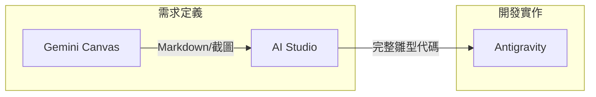

# CPDM 工具使用手冊

> 中心程式開發方法 (CPDM) 三大核心工具的操作指南與整合技巧

---

## 📋 目錄

1. [Gemini Canvas 使用指南](#1-gemini-canvas-使用指南) (前端人員)
2. [AI Studio 整合指南](#2-ai-studio-整合指南) (主管/PM)
3. [Antigravity 協作指南](#3-antigravity-協作指南) (開發者/工程師)
4. [工具間的資料傳遞](#4-工具間的資料傳遞)

---

## 1. Gemini Canvas 使用指南

**適用角色**: 前端人員 (Key-in People)  
**核心目標**: 產出視覺化的資料輸入畫面設計與規格定義

### 1.1 啟動與設定
1. 在 Gemini 對話框輸入：「開啟 Canvas 模式」或直接點擊 Canvas 圖示。
2. 設定專案背景：「我要設計一個[系統名稱]的[功能名稱]畫面」。

### 1.2 設計技巧
- **視覺化佈局**: 
  - 使用自然語言描述：「左邊是導覽列，右邊是表單，表單包含客戶姓名、電話...」。
  - 要求調整：「將電話欄位移到姓名旁邊，變成兩欄式排版」。
- **定義規格**: 
  - 在 Canvas 的Markdown編輯區 (或備註區) 詳細列出欄位屬性。
  - *範例*: `客戶姓名: String(50), 必填, 預設為空`
- **互動模擬**: 
  - 要求 Canvas 生成模擬資料：「請填入 3 筆範例資料讓我看看效果」。

### 1.3 產出交付
- **匯出設計**: 點擊分享/匯出，選擇 Markdown 或 HTML 格式。
- **截圖**: 針對關鍵狀態 (正常、錯誤、Loading) 截圖。
- **填寫模板**: 將設計細節填入 [前端Canvas設計模板](../模板/CPDM模板/前端Canvas設計模板.md)。

---

## 2. AI Studio 整合指南

**適用角色**: 上級主管 (Stakeholders) / PM  
**核心目標**: 整合多個 Canvas 設計，定義業務邏輯，產出可驗證的雛型

### 2.1 建立專案
1. 登入 Google AI Studio。
2. 建立新專案 (New Project)。
3. 設定 System Instructions：「你是一個系統整合專家，負責將分散的前端設計整合為一致的系統雛型...」。

### 2.2 匯入與整合
- **匯入 Canvas**: 將前端人員提供的 Markdown 規格或 HTML 代码貼入 Prompt。
- **指令範例**: 
  > "這是客戶資料畫面的設計 (附貼上內容)，這是訂單畫面的設計 (附貼上內容)。請幫我整合這兩個畫面，並建立一個主選單來切換它們。"

### 2.3 報表與 BI 設計
- **定義資料源**: 描述各畫面的資料關聯 (例如：訂單畫面的客戶ID來自客戶資料畫面)。
- **生成報表**: 
  > "請根據上述資料結構，設計一張「月度銷售報表」，欄位包含...，並用 ASCII 表格呈現預覽。"

### 2.4 產生雛型
- 要求 AI Studio 生成一個包含 HTML/JS 的單一檔案 (或多檔案結構) 作為互動雛型。
- 分享此雛型連結或檔案給團隊進行驗證。

---

## 3. Antigravity 協作指南

**適用角色**: 開發者 (Lead) & 工程師 (Engineers)  
**核心目標**: 將雛型轉化為生產級代碼，並進行協作開發

### 3.1 專案初始化 (Lead)
- **架構重構**: 將 AI Studio 的雛型代碼貼入 Antigravity，下達指令：
  > "分析此雛型，設計正規化的 MySQL 資料庫 Schema，並建立前後端分離的 React + Node.js 專案架構。"
- **任務拆分**: 利用 Antigravity 的 `task_boundary` 工具，將開發工作拆解為多個子任務 (Task)。

### 3.2 工程師協作 (Developers)
- **領取任務**: 每個工程師專注於 `task.md` 中的一個子項目。
- **上下文注入**: 在對話開始時，貼上相關的架構文檔或 Schema 定義。
- **實作與回報**: 
  - 利用 `write_to_file` 實作功能。
  - 遇到問題時，完整的 Error Log 貼給 Antigravity 分析。
  - 完成後，更新 `task.md` 狀態。

### 3.3 進度追蹤
- **日誌分析**: 定期使用 [進度追蹤工具](../工作流程/進度追蹤工具.md) 的方法分析對話日誌，識別卡關點。

---

## 4. 工具間的資料傳遞

### 流程圖

### 最佳實踐
1. **標準化格式**: 在 Canvas 階段就使用統一的命名慣例 (例如：駝峰式命名欄位)。
2. **盡早整合**: 不要等所有畫面都設計完美才進 AI Studio，分批整合可以及早發現邏輯矛盾。
3. **明確交付物**: 每個階段的交接都要有明確的文件 (Markdown 為佳)，避免口頭傳遞需求。

---

**版本**: 1.0  
**建立時間**: 2025-12-23
