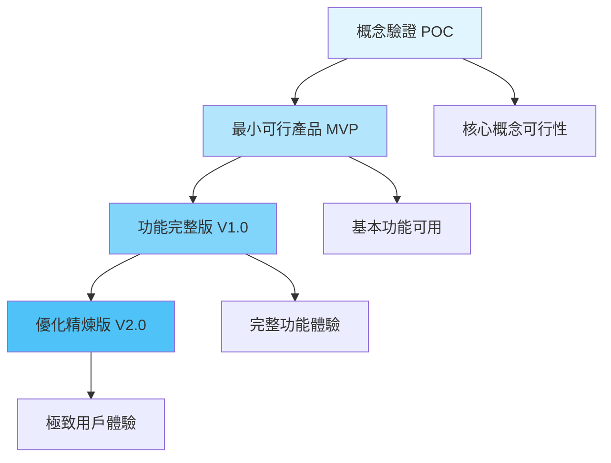

# Gemini 驅動的系統開發方法論 (GDDM)

> **Gemini-Driven Development Methodology**  
> 一套充分運用 AI 能力的革命性開發與專案管理模式

---

## 🎯 核心理念

### 傳統開發 vs. Gemini 驅動開發

| 面向 | 傳統開發 | Gemini 驅動開發 |
|------|---------|----------------|
| **需求分析** | 人工撰寫文檔 | AI 輔助需求探索與結構化 |
| **架構設計** | 經驗驅動 | AI 提供多方案比較與最佳實踐 |
| **程式碼實作** | 手動編寫 | AI 協作快速原型與迭代 |
| **問題解決** | 搜尋引擎 + 試錯 | 上下文感知的即時解決方案 |
| **知識管理** | 分散文檔 | 結構化知識圖譜自動累積 |
| **學習曲線** | 陡峭 | AI 引導的漸進式學習 |

---

## 🏗️ 五大核心支柱

### 1️⃣ 對話驅動開發 (Conversation-Driven Development)

**理念**: 將開發過程視為與 AI 的持續對話,每次對話都是知識的累積

#### 對話類型分類
- 🎨 **探索型對話**: 需求分析、技術選型、架構設計
- 🔨 **實作型對話**: 功能開發、問題修復、優化重構
- 🔍 **學習型對話**: 技術學習、最佳實踐、深度理解
- 📊 **分析型對話**: 專案回顧、效能分析、決策評估

#### 對話最佳實踐
```markdown
## 高效對話模板

### 開始新功能
1. **上下文設定**: "我正在開發 [專案名稱],目前進度是 [狀態]"
2. **明確目標**: "我想要實現 [具體功能],預期效果是 [描述]"
3. **提供限制**: "技術棧是 [列表],需要考慮 [限制條件]"
4. **請求方案**: "請提供實作方案,並說明優缺點"

### 解決問題
1. **問題描述**: "遇到 [具體問題],錯誤訊息是 [完整訊息]"
2. **環境資訊**: "使用 [技術/版本],相關程式碼是 [片段]"
3. **已嘗試**: "我已經嘗試 [方法列表],結果是 [描述]"
4. **請求協助**: "請幫我分析原因並提供解決方案"
```

---

### 2️⃣ 知識圖譜累積 (Knowledge Graph Accumulation)

**理念**: 每個專案都是一個知識節點,持續累積形成個人技術圖譜

#### 知識結構設計

```
AI專案管理/
├── 知識庫/
│   ├── 技術決策/
│   │   ├── 為什麼選擇React而非Vue.md
│   │   ├── Supabase vs Firebase 比較.md
│   │   └── 本地優先架構設計.md
│   ├── 問題解決/
│   │   ├── SQLite MISUSE 錯誤解決.md
│   │   ├── CORS 跨域問題處理.md
│   │   └── PDF 生成中文字體問題.md
│   ├── 最佳實踐/
│   │   ├── React Hooks 使用模式.md
│   │   ├── TypeScript 型別設計.md
│   │   └── 錯誤處理策略.md
│   └── 學習筆記/
│       ├── Capacitor 跨平台開發.md
│       ├── AI API 整合經驗.md
│       └── 效能優化技巧.md
```

#### 自動知識提取

每次對話結束後,使用以下模板記錄:

```markdown
# [知識主題]

**日期**: YYYY-MM-DD  
**專案**: [專案名稱]  
**對話 ID**: [conversation_id]

## 問題/需求
[簡述原始問題或需求]

## 解決方案
[採用的解決方案]

## 關鍵學習點
- 學習點 1
- 學習點 2
- 學習點 3

## 程式碼範例
\`\`\`typescript
// 關鍵程式碼片段
\`\`\`

## 相關資源
- [連結 1]
- [連結 2]

## 標籤
#技術棧 #問題類型 #難度等級
```

---

### 3️⃣ 迭代式精煉 (Iterative Refinement)

**理念**: 從 MVP 到完美,每次迭代都有明確目標

#### 三層迭代模型



#### 迭代檢查清單

**POC 階段** (1-2 天)
- [ ] 核心技術可行性驗證
- [ ] 最簡單的功能展示
- [ ] 技術風險評估
- [ ] 決定是否繼續

**MVP 階段** (1-2 週)
- [ ] 核心功能可用
- [ ] 基本 UI 完成
- [ ] 本地測試通過
- [ ] 可展示給用戶

**V1.0 階段** (2-4 週)
- [ ] 所有規劃功能完成
- [ ] 完整測試覆蓋
- [ ] 文檔齊全
- [ ] 可正式發布

**V2.0 階段** (持續)
- [ ] 用戶回饋整合
- [ ] 效能優化
- [ ] UX 精煉
- [ ] 新功能擴展

---

### 4️⃣ 上下文管理 (Context Management)

**理念**: 有效管理對話上下文,讓 AI 始終理解專案全貌

#### 上下文層次結構

```
第 1 層: 專案全局上下文
├── 專案目標與願景
├── 技術架構圖
├── 核心決策記錄
└── 當前狀態摘要

第 2 層: 當前任務上下文
├── 任務目標
├── 相關檔案
├── 已完成步驟
└── 下一步計畫

第 3 層: 即時對話上下文
├── 當前問題
├── 錯誤訊息
├── 程式碼片段
└── 期望結果
```

#### 上下文提供技巧

**開始新對話時**:
```markdown
## 專案上下文
- 專案: 福至心靈籤
- 類型: React 跨平台求籤應用
- 技術: React + TypeScript + Vite + Supabase
- 當前階段: 核心功能完成,規劃跨平台部署
- 最後進度: 完成歷史記錄月份篩選功能

## 當前任務
我想要 [具體描述任務]
```

**繼續之前的對話**:
```markdown
## 接續上次對話
上次我們討論了 [主題],已經完成 [內容]
現在我想要 [下一步]
```

---

### 5️⃣ 多模態協作 (Multi-Modal Collaboration)

**理念**: 充分利用 Gemini 的多模態能力 (文字、圖片、程式碼、文檔)

#### 多模態應用場景

| 模態 | 應用場景 | 範例 |
|------|---------|------|
| **文字** | 需求討論、程式碼審查 | 功能需求描述、程式碼解釋 |
| **圖片** | UI 設計、錯誤截圖 | 設計稿分析、錯誤畫面診斷 |
| **程式碼** | 實作、重構、除錯 | 功能開發、效能優化 |
| **文檔** | 架構設計、API 規格 | 系統架構圖、API 文檔 |
| **資料** | 分析、視覺化 | 專案統計、效能指標 |

#### 圖片驅動開發範例

```markdown
## UI 實作請求

[附上設計稿圖片]

請根據這個設計稿:
1. 分析 UI 結構和元件層次
2. 建議 React 元件拆分方式
3. 提供 CSS 實作方案
4. 指出需要注意的響應式設計點
```

---

## 🔄 完整開發流程

### 階段 0: 專案啟動 (Project Inception)

#### 0.1 願景對話
```markdown
與 AI 進行開放式對話:
- 我想做什麼?為什麼?
- 目標用戶是誰?
- 核心價值是什麼?
- 成功的標準是什麼?

輸出: 專案願景文檔
```

#### 0.2 可行性探索
```markdown
與 AI 討論:
- 技術可行性
- 時間評估
- 資源需求
- 風險識別

輸出: 可行性分析報告
```

#### 0.3 技術選型
```markdown
請 AI 提供:
- 多種技術方案比較
- 優缺點分析
- 學習曲線評估
- 推薦方案與理由

輸出: 技術選型決策文檔
```

---

### 階段 1: 規劃 (Planning)

#### 1.1 需求結構化
```markdown
## AI 輔助需求分析模板

### 功能需求
請幫我將以下想法結構化為功能需求:
[描述想法]

期望輸出:
- 用戶故事格式
- 優先級排序
- 依賴關係
- 驗收標準
```

#### 1.2 架構設計
```markdown
## AI 架構設計請求

專案: [名稱]
技術棧: [列表]
核心功能: [列表]

請提供:
1. 系統架構圖 (Mermaid)
2. 資料流程圖
3. 資料庫 Schema 設計
4. API 端點規劃
5. 目錄結構建議
```

#### 1.3 任務拆分
```markdown
請將 [功能] 拆分為可執行的開發任務:
- 每個任務 2-4 小時完成
- 按依賴關係排序
- 標註技術難點
- 提供驗收標準
```

---

### 階段 2: 開發 (Development)

#### 2.1 快速原型
```markdown
## 原型開發請求

功能: [描述]
技術: [列表]

請提供:
1. 最簡單可運行的程式碼
2. 關鍵部分的註解
3. 測試方法
4. 後續優化方向
```

#### 2.2 迭代實作
```markdown
## 功能迭代

當前狀態: [描述]
目標: [描述]

請幫我:
1. 審查現有程式碼
2. 提出改進建議
3. 實作新功能
4. 保持程式碼品質
```

#### 2.3 問題解決
```markdown
## 問題診斷與解決

問題: [描述]
環境: [資訊]
錯誤: [完整訊息]
已嘗試: [列表]

請:
1. 分析根本原因
2. 提供解決方案
3. 解釋原理
4. 預防類似問題
```

---

### 階段 3: 驗證 (Verification)

#### 3.1 程式碼審查
```markdown
## AI 程式碼審查

請審查以下程式碼:
[程式碼]

審查重點:
- [ ] 功能正確性
- [ ] 效能問題
- [ ] 安全性
- [ ] 可維護性
- [ ] 最佳實踐
- [ ] 潛在 bug
```

#### 3.2 測試策略
```markdown
## 測試計畫

功能: [描述]

請提供:
1. 測試案例清單
2. 邊界條件
3. 錯誤處理測試
4. 效能測試方法
```

#### 3.3 文檔生成
```markdown
## 文檔生成請求

請為 [功能/模組] 生成:
1. 使用說明
2. API 文檔
3. 範例程式碼
4. 常見問題
```

---

### 階段 4: 優化 (Optimization)

#### 4.1 效能分析
```markdown
## 效能優化

當前問題: [描述]
效能指標: [數據]

請分析:
1. 效能瓶頸
2. 優化方案
3. 預期改善
4. 實作步驟
```

#### 4.2 UX 精煉
```markdown
## UX 改進

當前體驗: [描述]
用戶回饋: [列表]

請建議:
1. UX 改進點
2. 實作方案
3. 優先級排序
```

---

## 📊 專案追蹤與分析

### 自動化指標收集

#### 對話統計
```markdown
## 專案對話分析

專案: [名稱]
時間範圍: [開始] - [結束]

統計:
- 總對話次數: X
- 總工作時間: X 小時
- 對話類型分布:
  - 探索型: X%
  - 實作型: X%
  - 學習型: X%
  - 分析型: X%

效率指標:
- 平均每對話產出: X 個功能
- 問題解決率: X%
- 程式碼品質評分: X/10
```

#### 知識累積追蹤
```markdown
## 知識成長曲線

時間軸:
- 技術決策文檔: X 篇
- 問題解決記錄: X 篇
- 最佳實踐總結: X 篇
- 學習筆記: X 篇

技能樹:
- React: ⭐⭐⭐⭐⭐
- TypeScript: ⭐⭐⭐⭐
- 跨平台開發: ⭐⭐⭐
- AI 整合: ⭐⭐⭐⭐
```

---

## 🎓 學習與成長

### AI 輔助學習路徑

#### 學習新技術模板
```markdown
## 學習計畫: [技術名稱]

背景: 我目前了解 [已知技術],想學習 [新技術]
目標: [學習目標]
時間: [預計時間]

請提供:
1. 學習路徑規劃
2. 核心概念清單
3. 實作練習專案
4. 學習資源推薦
5. 常見陷阱提醒
```

#### 深度理解請求
```markdown
## 深度學習: [主題]

我已經會用 [技術],但想深入理解:
- 底層原理
- 設計思想
- 最佳實踐
- 進階應用

請用漸進式方式解釋,從基礎到進階
```

---

## 🛠️ 工具與自動化

### 推薦工具鏈

#### 對話管理
- **對話標題規範**: `[專案名]-[類型]-[主題]`
- **對話標籤系統**: 使用標籤分類對話
- **對話摘要**: 每次對話結束後生成摘要

#### 知識管理
- **Obsidian**: 建立知識圖譜
- **Notion**: 專案管理與文檔
- **GitHub**: 程式碼與版本控制

#### 時間追蹤
- **自動記錄**: 每次對話的開始/結束時間
- **工作分類**: 規劃/開發/學習/除錯
- **效率分析**: 週報/月報自動生成

---

## 📈 持續改進

### 定期回顧機制

#### 每日回顧 (5 分鐘)
```markdown
## 今日總結 - YYYY-MM-DD

完成:
- [任務 1]
- [任務 2]

學習:
- [學習點 1]
- [學習點 2]

明日計畫:
- [任務 1]
- [任務 2]
```

#### 每週回顧 (30 分鐘)
```markdown
## 週回顧 - Week XX

本週成就:
- 完成功能: [列表]
- 解決問題: [列表]
- 學習技術: [列表]

數據統計:
- 工作時間: X 小時
- 對話次數: X 次
- 程式碼行數: X 行

下週目標:
- [目標 1]
- [目標 2]

改進點:
- [改進 1]
- [改進 2]
```

#### 專案回顧 (專案結束時)
```markdown
## 專案回顧: [專案名稱]

專案概況:
- 時間: [開始] - [結束]
- 總時長: X 小時
- 對話次數: X 次

技術棧:
- [技術列表]

主要成就:
- [成就 1]
- [成就 2]

關鍵挑戰:
- [挑戰 1]: [解決方案]
- [挑戰 2]: [解決方案]

技術成長:
- [成長點 1]
- [成長點 2]

可複用資產:
- [元件/工具 1]
- [元件/工具 2]

下次改進:
- [改進點 1]
- [改進點 2]
```

---

## 🎯 成功指標

### 效率指標
- ⚡ **開發速度**: 從想法到 MVP 的時間
- 🎯 **問題解決率**: 一次對話解決問題的比例
- 📈 **程式碼品質**: 重構次數、bug 率

### 學習指標
- 📚 **知識累積**: 文檔數量、知識圖譜節點數
- 🌱 **技能成長**: 新技術掌握數量
- 💡 **創新能力**: 獨立解決問題的能力提升

### 體驗指標
- 😊 **開發愉悅度**: 主觀評分
- 🔥 **持續動力**: 專案持續時間
- 🎨 **創作滿意度**: 成品質量評分

---

## 💡 實踐案例: 福至心靈籤專案

### 應用 GDDM 的成果

**專案時間**: 2025-12-17 ~ 2025-12-22 (5 天)  
**總工作時間**: 23.8 小時  
**對話次數**: 10 次  
**完成功能**: 7 個主要模組

### 關鍵成功因素

1. **清晰的對話結構**: 每次對話都有明確目標
2. **持續的上下文管理**: AI 始終理解專案狀態
3. **快速迭代**: 從概念到可用產品僅 5 天
4. **知識累積**: 解決的每個問題都成為知識資產
5. **多模態協作**: 結合文字、程式碼、圖片

### 具體應用範例

#### 範例 1: SQLite 錯誤解決
```markdown
對話類型: 實作型
時間: 2025-12-17
問題: SQLITE_MISUSE 錯誤
解決: 移除 mutex,正確處理非同步
學習: SQLite 執行緒安全機制
文檔: 問題解決/SQLite MISUSE 錯誤解決.md
```

#### 範例 2: 跨平台部署規劃
```markdown
對話類型: 探索型
時間: 2025-12-21
需求: 規劃跨平台部署
產出: 詳細的部署計畫文檔
學習: Capacitor 跨平台開發
文檔: 技術決策/跨平台部署方案.md
```

---

## 🚀 開始使用 GDDM

### 第一步: 設定工作區

1. 複製本文檔到你的專案
2. 建立知識庫目錄結構
3. 準備第一個專案模板

### 第二步: 開始第一個專案

1. 使用「專案啟動」流程
2. 與 AI 進行願景對話
3. 建立專案文檔
4. 開始第一次迭代

### 第三步: 建立習慣

1. 每次對話後記錄摘要
2. 每日/每週回顧
3. 持續累積知識
4. 定期優化流程

---

## 📚 延伸閱讀

- [對話驅動開發實踐指南](./對話驅動開發指南.md)
- [知識圖譜建立方法](./知識圖譜建立.md)
- [AI 協作最佳實踐](./AI協作最佳實踐.md)
- [專案模板集合](../模板/)

---

**版本**: 1.0  
**建立時間**: 2025-12-22  
**作者**: Arthur (with Gemini)  
**授權**: MIT

---

> 💡 **核心思想**: 不是用 AI 取代開發者,而是與 AI 協作,成為更好的開發者

> 🌟 **終極目標**: 從想法到產品,更快、更好、更愉悅
