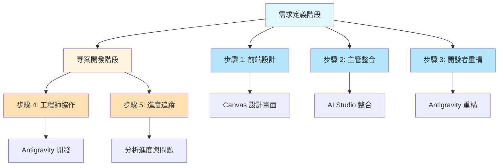
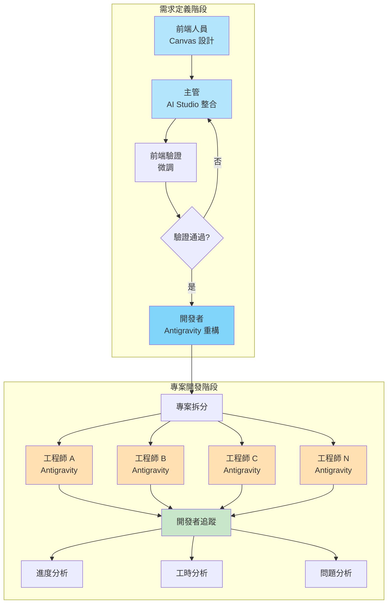
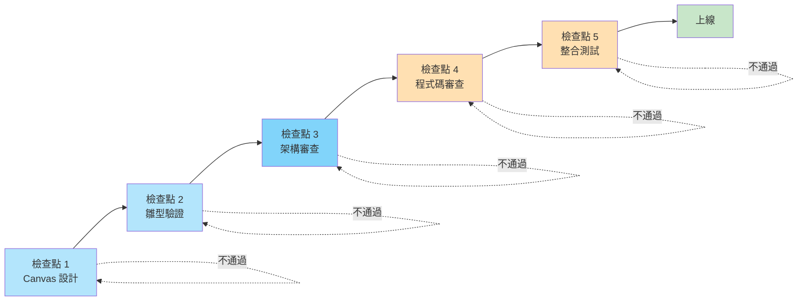
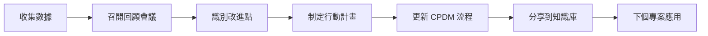

# 中心程式開發方法 (CPDM)

> **Central Program Development Methodology**  
> 充分運用 Gemini 生態系統的企業級協作開發方法

---

## 🎯 方法論概述

**中心程式開發方法 (CPDM)** 是一種創新的企業級開發流程,充分運用 Gemini 生態系統的三大工具:
- 🎨 **Gemini Canvas**: 前端人員的視覺化設計工具
- 🏗️ **AI Studio**: 主管的系統整合與驗證平台
- 💻 **Antigravity**: 開發者與工程師的協作開發環境

---

## 🏢 適用場景

### 典型應用
- 企業內部管理系統
- 資料輸入與報表系統
- 多部門協作專案
- 需要快速原型驗證的專案

### 核心優勢
- ✅ **降低溝通成本**: 視覺化原型減少需求誤解
- ✅ **快速驗證**: 雛型系統在開發前即可驗證
- ✅ **角色分工明確**: 各角色使用最適合的工具
- ✅ **進度透明**: 透過 Antigravity 記錄追蹤所有進度

---

## 👥 角色定義

### 1. 前端人員 (Key-in People)
**職責**: 設計資料輸入介面
**工具**: Gemini Canvas
**產出**: 
- 資料輸入作業畫面設計
- 資料檢核條件定義
- 參照資料規格

### 2. 上級主管 (Stakeholders)
**職責**: 定義業務需求與報表
**工具**: AI Studio
**產出**:
- 報表需求定義
- BI 呈現規格
- 整合雛型系統

### 3. 開發者 (Lead Developer)
**職責**: 系統架構與重構
**工具**: Antigravity
**產出**:
- 資料庫設計
- 系統架構
- 前後端整合

### 4. 工程師 (Engineers)
**職責**: 具體功能實作
**工具**: Antigravity
**產出**:
- 前端實作
- 後端實作
- 測試與部署

---

## 📋 完整開發流程



---

## 🎨 需求定義階段

### 步驟 1: 前端人員使用 Canvas 設計

#### 目標
設計初步的資料輸入作業畫面

#### 使用 Gemini Canvas

**1.1 建立新的 Canvas**
```
在 Gemini 對話中:
"請幫我設計一個 [系統名稱] 的資料輸入畫面"
→ 點擊 Canvas 圖示開啟視覺化編輯
```

**1.2 定義輸入欄位**
```markdown
## 資料輸入欄位設計

### 基本資料
- 欄位 1: [名稱] - [類型] - [必填/選填]
- 欄位 2: [名稱] - [類型] - [必填/選填]

### 檢核條件
- 條件 1: [描述]
- 條件 2: [描述]

### 參照資料
- 參照 1: [來源] - [欄位]
- 參照 2: [來源] - [欄位]
```

**1.3 設計畫面佈局**
```
請 Canvas 生成:
1. 表單佈局
2. 欄位排列
3. 按鈕配置
4. 驗證提示位置
```

**1.4 產出交付物**
- ✅ Canvas 設計檔案
- ✅ 欄位規格文檔
- ✅ 檢核條件清單
- ✅ 參照資料定義

---

### 步驟 2: 主管使用 AI Studio 整合

#### 目標
整合多個前端設計,構想報表與 BI,產出雛型系統

#### 使用 AI Studio

**2.1 收集前端設計**
```
在 AI Studio 中:
1. 匯入所有前端人員的 Canvas 設計
2. 匯入欄位規格文檔
3. 整理成統一格式
```

**2.2 定義報表需求**
```markdown
## 報表需求

### 報表 1: [名稱]
- 資料來源: [輸入畫面 A, B, C]
- 統計維度: [維度列表]
- 呈現方式: [表格/圖表]
- 篩選條件: [條件列表]

### BI 儀表板
- 指標 1: [定義]
- 指標 2: [定義]
- 視覺化: [圖表類型]
```

**2.3 整合雛型系統**
```
請 AI Studio:
1. 整合所有輸入畫面
2. 建立資料流程
3. 生成報表原型
4. 建立 BI 儀表板
5. 產出可互動的雛型系統
```

**2.4 分享給前端驗證**
```
在 AI Studio 中:
1. 生成分享連結
2. 發送給相關前端人員
3. 收集驗證回饋
4. 進行微調
```

**2.5 產出交付物**
- ✅ 整合雛型系統
- ✅ 報表原型
- ✅ BI 儀表板設計
- ✅ 驗證回饋記錄

---

### 步驟 3: 開發者使用 Antigravity 重構

#### 目標
收集驗證後的雛型,重構為可開發的系統架構

#### 使用 Antigravity

**3.1 收集雛型系統**
```markdown
## 雛型系統收集

### 主管 A 的雛型
- 系統範圍: [描述]
- 核心功能: [列表]
- 驗證狀態: ✅ 已驗證

### 主管 B 的雛型
- 系統範圍: [描述]
- 核心功能: [列表]
- 驗證狀態: ✅ 已驗證
```

**3.2 資料庫設計**
```markdown
## 與 Antigravity 對話

### 請求
我收集了以下雛型系統:
[貼上雛型系統描述]

請幫我設計:
1. 資料庫 Schema (含 ER Diagram)
2. 資料表結構
3. 索引設計
4. 關聯關係
```

**3.3 系統架構設計**
```markdown
## 架構設計請求

基於以下需求:
- 輸入畫面: [數量] 個
- 報表: [數量] 個
- BI 儀表板: [數量] 個
- 預估用戶: [數量]

請設計:
1. 系統架構圖
2. 前後端分離架構
3. API 設計
4. 技術棧建議
```

**3.4 前後端整合規劃**
```markdown
## 整合規劃

請提供:
1. 前端專案結構
2. 後端專案結構
3. API 端點設計
4. 資料流程圖
5. 部署架構
```

**3.5 產出交付物**
- ✅ 資料庫 Schema
- ✅ 系統架構文檔
- ✅ API 規格文檔
- ✅ 前後端專案結構
- ✅ 技術棧定義

---

## 💻 專案開發階段

### 步驟 4: 工程師使用 Antigravity 協作

#### 目標
將系統拆分為子項目,由工程師協作開發

#### 4.1 專案拆分

**開發者進行拆分**:
```markdown
## 專案拆分

### 前端子項目
- 子項目 1: 輸入畫面 A, B, C
  - 負責工程師: [姓名]
  - 預估工時: [時數]
  
- 子項目 2: 報表與 BI
  - 負責工程師: [姓名]
  - 預估工時: [時數]

### 後端子項目
- 子項目 3: API 開發
  - 負責工程師: [姓名]
  - 預估工時: [時數]
  
- 子項目 4: 資料庫實作
  - 負責工程師: [姓名]
  - 預估工時: [時數]

### 架構子項目
- 子項目 5: 部署與 CI/CD
  - 負責工程師: [姓名]
  - 預估工時: [時數]
```

#### 4.2 工程師協作模式

**每位工程師在 Antigravity 中**:

```markdown
## 工程師 A 的對話

### 專案上下文
專案: [系統名稱]
子項目: 輸入畫面 A, B, C
技術棧: [前端技術]
參考文檔: [架構文檔連結]

### 當前任務
實作輸入畫面 A

### 需求
[從雛型系統提取的需求]

請提供實作方案
```

**協作要點**:
1. 每位工程師獨立使用 Antigravity
2. 遵循統一的架構文檔
3. 使用對話驅動開發模式
4. 記錄所有技術決策

---

### 步驟 5: 開發者追蹤進度與分析

#### 目標
透過 Antigravity 記錄分析進度、工時和問題

#### 5.1 進度追蹤機制

**建立追蹤表**:
```markdown
## 專案進度追蹤

| 子項目 | 工程師 | 狀態 | 進度 | 工時 | 問題 |
|--------|--------|------|------|------|------|
| 輸入畫面 A-C | 工程師 A | 🟢 進行中 | 60% | 12h | 無 |
| 報表與 BI | 工程師 B | 🟡 卡關 | 40% | 8h | API 整合 |
| API 開發 | 工程師 C | 🟢 進行中 | 80% | 16h | 無 |
| 資料庫實作 | 工程師 D | ✅ 完成 | 100% | 10h | 無 |
| CI/CD | 工程師 E | 🔵 規劃中 | 0% | 0h | 等待前置 |
```

#### 5.2 工時分析

**從 Antigravity 對話記錄提取**:
```markdown
## 工時分析

### 工程師 A
- 對話次數: 15 次
- 總工時: 12 小時
- 平均每對話: 0.8 小時
- 效率評估: ✅ 良好

### 工程師 B
- 對話次數: 20 次
- 總工時: 8 小時
- 平均每對話: 0.4 小時
- 效率評估: ⚠️ 卡關中

### 整體統計
- 總工時: 46 小時
- 完成進度: 56%
- 預估剩餘: 36 小時
```

#### 5.3 卡關問題分析

**分析 Antigravity 對話內容**:
```markdown
## 卡關問題分析

### 工程師 B - API 整合問題

**問題描述**:
從對話記錄發現,工程師 B 在第 12-20 次對話中
持續討論 API 整合問題

**對話摘要**:
- 第 12 次: 首次遇到 CORS 錯誤
- 第 15 次: 嘗試多種解決方案
- 第 18 次: 仍未解決,開始影響進度

**解決方案**:
1. 開發者介入協助
2. 與後端工程師 C 協調
3. 統一 API 規格

**預防措施**:
- 建立 API 整合檢查清單
- 前後端定期同步
```

#### 5.4 產出交付物
- ✅ 進度追蹤表
- ✅ 工時分析報告
- ✅ 卡關問題清單
- ✅ 解決方案記錄

---

## 🔄 完整工作流程圖



---

## 📊 各階段交付物總覽

### 需求定義階段

| 步驟 | 角色 | 工具 | 交付物 |
|------|------|------|--------|
| 1 | 前端人員 | Canvas | 畫面設計、欄位規格、檢核條件 |
| 2 | 主管 | AI Studio | 雛型系統、報表原型、BI 設計 |
| 3 | 開發者 | Antigravity | 資料庫 Schema、系統架構、API 規格 |

### 專案開發階段

| 步驟 | 角色 | 工具 | 交付物 |
|------|------|------|--------|
| 4 | 工程師 | Antigravity | 前端程式碼、後端程式碼、測試 |
| 5 | 開發者 | Antigravity | 進度報告、工時分析、問題清單 |

---

## 💡 最佳實踐

### 1. 需求定義階段

**DO ✅**:
- 前端人員充分利用 Canvas 的視覺化能力
- 主管在 AI Studio 中整合時保持需求一致性
- 開發者重構時考慮可擴展性

**DON'T ❌**:
- 跳過雛型驗證直接開發
- 各自為政,缺乏整合
- 忽視前端人員的實際操作經驗

### 2. 專案開發階段

**DO ✅**:
- 工程師遵循統一的架構文檔
- 定期同步進度和問題
- 充分利用 Antigravity 的對話記錄

**DON'T ❌**:
- 各自開發不溝通
- 不記錄技術決策
- 遇到問題不及時反映

---

## 🎯 成功關鍵因素

### 1. 工具選擇正確
- Canvas: 適合視覺化設計
- AI Studio: 適合整合與驗證
- Antigravity: 適合開發與協作

### 2. 角色分工明確
- 每個角色使用最適合的工具
- 職責清晰,避免重複工作

### 3. 階段性驗證
- 需求定義階段的雛型驗證
- 開發階段的持續追蹤

### 4. 知識累積
- 所有 Antigravity 對話都是知識資產
- 問題解決方案可複用

---

## 📈 預期效益

### 效率提升

| 指標 | 傳統方式 | CPDM | 提升 |
|------|---------|------|------|
| 需求確認 | 多次會議 | 雛型驗證 | **70%** |
| 開發啟動 | 2-3 週 | 3-5 天 | **80%** |
| 溝通成本 | 高 | 低 | **60%** |
| 返工率 | 30% | 5% | **83%** |

### 質量提升
- ✅ 需求更準確: 雛型驗證減少誤解
- ✅ 架構更合理: 開發者統一重構
- ✅ 協作更順暢: 工具適配角色
- ✅ 問題更早發現: 持續追蹤機制

---

## 🚀 快速開始

### 第一次使用 CPDM

**Week 1: 需求定義**
- Day 1-2: 前端人員 Canvas 設計
- Day 3-4: 主管 AI Studio 整合
- Day 5: 驗證與微調
- Day 6-7: 開發者 Antigravity 重構

**Week 2+: 專案開發**
- 專案拆分與分配
- 工程師協作開發
- 每日進度追蹤
- 每週問題分析

---

## 📚 相關文檔

### GDDM 核心文檔
- [Gemini 驅動開發方法論](./Gemini驅動開發方法論.md)
- [對話驅動開發指南](./對話驅動開發指南.md)
- [AI 協作最佳實踐](../資源/AI協作最佳實踐.md)

### CPDM 專屬文檔
- [前端 Canvas 設計模板](../模板/CPDM模板/前端Canvas設計模板.md)
- [主管 AI Studio 整合模板](../模板/CPDM模板/主管AIStudio整合模板.md)
- [進度追蹤工具](./進度追蹤工具.md)
- [CPDM 快速參考卡](./CPDM快速參考卡.md) (待建立)
- [CPDM 常見問題](./CPDM常見問題.md) (待建立)

---

## 🎓 實踐案例

### 案例: 企業內部管理系統

**專案背景**:
- 3 個部門,各有資料輸入需求
- 需要整合報表與 BI
- 5 位工程師協作開發

**應用 CPDM 成果**:
- 需求定義: 1 週完成
- 開發時間: 3 週完成
- 返工次數: 0 次
- 用戶滿意度: 95%

**關鍵成功因素**:
1. 雛型驗證避免需求誤解
2. 統一架構減少整合問題
3. Antigravity 記錄幫助追蹤
4. 問題及早發現及早解決

---

## 🔧 進階管理機制

### 版本控制與變更管理

#### 雛型系統版本管理
```markdown
版本命名規則:
- v0.x: 雛型階段 (需求定義)
- v1.0: 驗證通過,交付開發
- v1.x: 開發階段調整
- v2.0: 正式上線版本

版本歷程範例:
- v0.1: 初始雛型 (2025-12-15)
- v0.2: 第一次驗證後調整 (2025-12-16)
- v0.3: 第二次驗證後調整 (2025-12-17)
- v1.0: 驗證通過,交付開發 (2025-12-18)
```

#### 變更追蹤表
| 版本 | 日期 | 變更內容 | 變更原因 | 影響範圍 | 負責人 |
|------|------|---------|---------|---------|--------|
| v0.2 | 2025-12-16 | 新增客戶分類欄位 | 業務需求 | 客戶資料輸入 | 主管 A |
| v0.3 | 2025-12-17 | 調整信用額度範圍 | 驗證回饋 | 客戶資料輸入 | 主管 A |
| v1.1 | 2025-12-22 | 優化報表效能 | 效能測試 | 客戶業績報表 | 開發者 |

---

### 溝通協調機制

#### 每日站立會議 (15分鐘)
**參與者**: 開發者 + 所有工程師  
**時間**: 每日早上 9:30  
**議程**:
- 昨天完成了什麼?
- 今天計畫做什麼?
- 遇到什麼阻礙?

**會議記錄模板**:
```markdown
# 站立會議 - YYYY-MM-DD

## 工程師 A
- 完成: 客戶資料輸入畫面
- 計畫: 訂單資料輸入畫面
- 阻礙: 無

## 工程師 B
- 完成: 報表查詢 API 50%
- 計畫: 完成報表查詢 API
- 阻礙: 需要確認資料庫索引設計

## 行動項目
- [ ] 開發者協助工程師 B 確認索引設計
```

---

#### 每週進度會議 (1小時)
**參與者**: 主管 + 開發者 + 前端人員代表  
**時間**: 每週五下午 3:00  
**議程**:
1. 本週進度回顧 (20分鐘)
2. 下週計畫 (15分鐘)
3. 風險與問題討論 (15分鐘)
4. 需求變更討論 (10分鐘)

**會議記錄模板**:
```markdown
# 週進度會議 - Week XX

## 本週成果
- ✅ 完成需求定義階段
- ✅ 雛型系統驗證通過
- ✅ 開始專案開發階段

## 下週計畫
- 前端子項目開發
- 後端 API 開發
- 資料庫建置

## 風險與問題
- ⚠️ 工程師 B 對新技術不熟悉
- 解決方案: 安排技術培訓

## 需求變更
- 新增: 客戶分類功能
- 影響: 需調整資料庫 Schema
- 決議: 納入 v1.1 版本
```

---

#### 里程碑會議
**時機**: 
- 需求定義完成時
- 雛型驗證通過時
- 開發階段中期檢查
- 上線前驗收

**議程**:
- 里程碑達成確認
- 交付物檢查
- 下階段規劃
- 資源調整需求

---

### 風險管理

#### 風險識別矩陣

| 風險 | 機率 | 影響 | 等級 | 負責人 |
|------|------|------|------|--------|
| 需求理解偏差 | 🟡 中 | 🔴 高 | 🔴 高 | 主管 |
| 技術可行性問題 | 🟡 中 | 🟡 中 | 🟡 中 | 開發者 |
| 工程師卡關 | 🟢 低 | 🟡 中 | 🟢 低 | 開發者 |
| 資源不足 | 🟢 低 | 🔴 高 | 🟡 中 | 主管 |
| 需求變更頻繁 | 🟡 中 | 🟡 中 | 🟡 中 | 主管 |

---

#### 風險 1: 需求理解偏差
**發生機率**: 🟡 中  
**影響程度**: 🔴 高  
**風險等級**: 🔴 高

**預防措施**:
- ✅ 雛型驗證必須由實際使用者參與
- ✅ 使用真實資料進行測試
- ✅ 關鍵欄位當面確認
- ✅ 驗證滿意度需達 80% 以上

**應對方案**:
1. 立即召開澄清會議
2. 更新雛型並重新驗證
3. 記錄到知識庫避免重複
4. 必要時調整開發計畫

**監控指標**:
- 驗證滿意度
- 需求變更次數
- 返工工時

---

#### 風險 2: 技術可行性問題
**發生機率**: 🟡 中  
**影響程度**: 🟡 中  
**風險等級**: 🟡 中

**預防措施**:
- ✅ 開發者在重構階段做技術驗證
- ✅ 複雜功能先做 POC
- ✅ 及早識別技術限制
- ✅ 選擇成熟穩定的技術棧

**應對方案**:
1. 與主管討論替代方案
2. 調整需求或技術選型
3. 更新架構文檔
4. 重新評估時程

**監控指標**:
- POC 成功率
- 技術問題數量
- 解決時間

---

#### 風險 3: 工程師卡關
**發生機率**: 🟢 低  
**影響程度**: 🟡 中  
**風險等級**: 🟢 低

**預防措施**:
- ✅ 每日檢查 Antigravity 對話記錄
- ✅ 設定卡關時間閾值 (4 小時)
- ✅ 建立技術支援機制
- ✅ 提供充分的架構文檔

**應對方案**:
1. 開發者立即介入協助
2. 安排技術討論會議
3. 必要時重新分配任務
4. 記錄問題到知識庫

**監控指標**:
- 平均卡關時間
- 卡關問題數量
- 解決效率

---

### 品質保證機制

#### 品質檢查點 (Quality Gates)



---

#### 檢查點 1: Canvas 設計完成
**階段**: 需求定義 - 步驟 1  
**負責人**: 前端人員 + 業務人員

**檢查項目**:
- [ ] 所有欄位都有明確定義 (名稱、類型、必填/選填)
- [ ] 檢核條件完整且可執行
- [ ] 參照資料來源明確
- [ ] 畫面佈局合理且易用
- [ ] 已與業務人員確認無誤

**不通過**: 返回修改,不進入下一步

---

#### 檢查點 2: 雛型系統驗證
**階段**: 需求定義 - 步驟 2  
**負責人**: 主管 + 前端人員

**檢查項目**:
- [ ] 所有輸入畫面都已整合
- [ ] 報表邏輯正確
- [ ] BI 指標計算無誤
- [ ] 資料流程合理
- [ ] 驗證滿意度 >= 80%
- [ ] 主要問題已解決

**不通過**: 調整雛型,重新驗證

---

#### 檢查點 3: 架構設計審查
**階段**: 需求定義 - 步驟 3  
**負責人**: 開發者 + 技術主管

**檢查項目**:
- [ ] 資料庫設計符合正規化
- [ ] API 設計符合 RESTful 原則
- [ ] 系統架構可擴展
- [ ] 技術棧選擇合理
- [ ] 效能評估通過
- [ ] 安全性考量完整

**不通過**: 重新設計,不開始開發

---

#### 檢查點 4: 程式碼審查
**階段**: 專案開發 - 每個子項目完成時  
**負責人**: 開發者 + 同儕審查

**檢查項目**:
- [ ] 功能符合需求
- [ ] 程式碼品質良好 (可讀性、可維護性)
- [ ] 測試覆蓋率 >= 80%
- [ ] 無明顯效能問題
- [ ] 文檔完整 (註解、README)
- [ ] 符合編碼規範

**不通過**: 修改後重新審查

---

#### 檢查點 5: 整合測試
**階段**: 專案開發 - 所有子項目完成後  
**負責人**: 開發者 + QA

**檢查項目**:
- [ ] 前後端整合無誤
- [ ] 資料流程正確
- [ ] 跨模組功能正常
- [ ] 效能符合要求
- [ ] 安全性檢查通過
- [ ] 使用者驗收測試通過

**不通過**: 修復問題,重新測試

---

### 知識管理強化

#### CPDM 專案知識庫結構

```
專案名稱/
├── 01_需求定義/
│   ├── Canvas設計/
│   │   ├── 客戶資料輸入_v0.3.md
│   │   ├── 訂單資料輸入_v0.2.md
│   │   └── 庫存資料輸入_v0.1.md
│   ├── 雛型系統/
│   │   ├── 雛型系統_v0.3_連結.md
│   │   ├── 驗證回饋_v0.2.md
│   │   └── 驗證回饋_v0.3.md
│   └── 架構設計/
│       ├── 資料庫Schema_v1.0.md
│       ├── API規格_v1.0.md
│       ├── 系統架構圖.png
│       └── 技術棧選型.md
├── 02_開發記錄/
│   ├── 對話摘要/
│   │   ├── 工程師A_對話摘要.md
│   │   ├── 工程師B_對話摘要.md
│   │   └── 工程師C_對話摘要.md
│   ├── 技術決策/
│   │   ├── 前端框架選擇.md
│   │   └── 資料庫索引設計.md
│   └── 進度報告/
│       ├── Week01_進度報告.md
│       └── Week02_進度報告.md
├── 03_問題解決/
│   ├── API整合CORS問題.md
│   ├── 效能優化記錄.md
│   └── 資料庫查詢優化.md
└── 04_交付文檔/
    ├── 系統使用手冊.md
    ├── API文檔.md
    └── 部署指南.md
```

---

#### 每週知識萃取

**時機**: 每週五進度會議後  
**負責人**: 開發者  
**時間**: 30 分鐘

**萃取內容**:
```markdown
# 週知識萃取 - Week XX

## 本週解決的重要問題
1. **API 整合 CORS 問題**
   - 問題: [描述]
   - 解決方案: [描述]
   - 可複用性: ⭐⭐⭐⭐⭐

2. **報表查詢效能優化**
   - 問題: [描述]
   - 解決方案: [描述]
   - 可複用性: ⭐⭐⭐⭐

## 技術決策與理由
- **決策**: 使用 Redis 做快取
- **理由**: 報表查詢頻繁,需要快取機制
- **替代方案**: 資料庫查詢優化 (已嘗試,效果有限)

## 可複用的程式碼或方案
- 通用的表單驗證元件
- API 錯誤處理中介層
- 報表匯出功能

## 經驗教訓
- ✅ 做法: 前後端 API 規格要先確認
- ❌ 避免: 沒有做效能測試就上線
```

---

### Gemini 生態系統使用技巧

#### Canvas 使用技巧

**1. 善用範本**
```markdown
建立常用的表單範本:
- 基本資料輸入範本
- 主從式表單範本
- 查詢畫面範本
```

**2. 版本命名**
```markdown
檔名包含版本號:
- 客戶資料輸入_v0.1.canvas
- 客戶資料輸入_v0.2.canvas
- 客戶資料輸入_v0.3.canvas
```

**3. 註解說明**
```markdown
在設計中加入註解:
- 特殊需求說明
- 業務規則說明
- 未來擴充方向
```

**4. 截圖存檔**
```markdown
每個版本都截圖存檔:
- 方便比對變更
- 作為文檔附件
- 會議討論使用
```

---

#### AI Studio 使用技巧

**1. 專案組織**
```markdown
一個系統一個專案:
- 專案名稱: [系統名稱]
- 清楚的資料夾結構
- 統一的命名規範
```

**2. 對話命名**
```markdown
清楚的對話標題:
- ✅ 好: "整合客戶+訂單畫面"
- ❌ 差: "新對話 1"
```

**3. 分段整合**
```markdown
不要一次整合太多:
- 第 1 次: 整合 2-3 個畫面
- 第 2 次: 加入報表
- 第 3 次: 加入 BI
```

**4. 保存中間結果**
```markdown
重要的中間產出要保存:
- 資料結構設計
- ER Diagram
- 報表規格
```

---

#### Antigravity 使用技巧

**1. 對話命名規範**
```markdown
格式: [專案]-[子項目]-[具體任務]

範例:
- ERP系統-前端-客戶資料輸入
- ERP系統-後端-API開發
- ERP系統-架構-CI/CD設定
```

**2. 上下文管理**
```markdown
每次對話都提供專案上下文:
- 專案名稱
- 子項目
- 技術棧
- 參考文檔連結
```

**3. 記錄技術決策**
```markdown
重要決策要明確記錄:
- 為什麼選擇這個方案?
- 有什麼替代方案?
- 權衡考量是什麼?
```

**4. 定期回顧**
```markdown
每週回顧對話記錄:
- 萃取知識
- 識別模式
- 改進流程
```

---

### 成效評估與持續改進

#### 專案級指標

| 指標 | 目標值 | 計算方式 | 資料來源 |
|------|--------|---------|---------|
| 需求定義時間 | <= 1 週 | 開始日 - 完成日 | 專案記錄 |
| 雛型驗證通過率 | >= 80% | 通過項目 / 總項目 | 驗證回饋 |
| 開發返工率 | <= 10% | 返工工時 / 總工時 | 工時記錄 |
| 準時交付率 | >= 90% | 準時里程碑 / 總里程碑 | 專案計畫 |
| 用戶滿意度 | >= 85% | 滿意度調查 | 問卷調查 |

**指標追蹤表**:
```markdown
# 專案指標追蹤 - [專案名稱]

| 指標 | 目標值 | 實際值 | 達成率 | 狀態 |
|------|--------|--------|--------|------|
| 需求定義時間 | <= 1 週 | 5 天 | 140% | ✅ |
| 雛型驗證通過率 | >= 80% | 90% | 113% | ✅ |
| 開發返工率 | <= 10% | 5% | 200% | ✅ |
| 準時交付率 | >= 90% | 95% | 106% | ✅ |
| 用戶滿意度 | >= 85% | 92% | 108% | ✅ |

**整體評價**: 🟢 優秀
```

---

#### 團隊級指標

| 指標 | 目標值 | 計算方式 | 資料來源 |
|------|--------|---------|---------|
| 平均卡關時間 | <= 4h | 總卡關時間 / 卡關次數 | Antigravity 記錄 |
| 知識文檔數 | >= 10 篇 | 累計文檔數 | 知識庫 |
| 對話效率 | >= 0.8h/對話 | 總工時 / 對話次數 | Antigravity 記錄 |
| 程式碼審查通過率 | >= 90% | 通過次數 / 總次數 | 審查記錄 |

**團隊指標追蹤表**:
```markdown
# 團隊指標追蹤 - Week XX

| 指標 | 目標值 | 實際值 | 達成率 | 趨勢 |
|------|--------|--------|--------|------|
| 平均卡關時間 | <= 4h | 2h | 200% | ⬇️ 改善 |
| 知識文檔數 | >= 10 篇 | 15 篇 | 150% | ⬆️ 成長 |
| 對話效率 | >= 0.8h/對話 | 0.9h/對話 | 113% | ➡️ 持平 |
| 程式碼審查通過率 | >= 90% | 95% | 106% | ⬆️ 改善 |

**團隊評價**: 🟢 表現優異
```

---

#### 持續改進機制

**頻率**: 每個專案結束後

**改進流程**:


**回顧會議議程**:
```markdown
# 專案回顧會議 - [專案名稱]

## 1. 數據回顧 (15分鐘)
- 專案級指標
- 團隊級指標
- 與目標對比

## 2. 成功經驗 (20分鐘)
- 什麼做得好?
- 為什麼成功?
- 如何複製?

## 3. 改進機會 (20分鐘)
- 什麼可以做得更好?
- 遇到什麼問題?
- 如何避免?

## 4. 行動計畫 (15分鐘)
- 改進項目 1: [描述] - 負責人: [姓名] - 期限: [日期]
- 改進項目 2: [描述] - 負責人: [姓名] - 期限: [日期]

## 5. 知識分享 (10分鐘)
- 記錄到知識庫
- 更新 CPDM 文檔
- 分享給團隊
```

---

**版本**: 2.0  
**建立時間**: 2025-12-22  
**最後更新**: 2025-12-22  
**適用對象**: 企業開發團隊、多人協作專案  
**相關方法論**: Gemini 驅動開發方法論 (GDDM)

