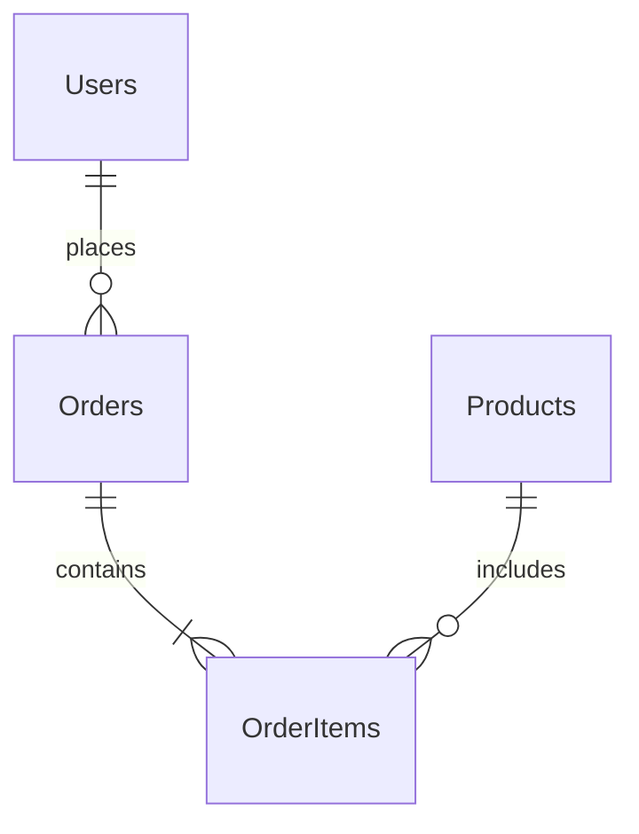

# 系統架構設計指南模板 (開發者用)

> 用於開發者 (Lead Developer) 在將雛型轉化為正式系統架構時的分析與設計模板

---

## 1. 系統概觀 (System Overview)

### 1.1 專案目標
[簡述專案的商業目標與核心價值，從 AI Studio 雛型中提取]

### 1.2 系統範圍 (Scope)
- **包含功能**: [列出主要功能模組]
- **不包含功能**: [列出暫不實作的部分]

### 1.3 限制條件 (Constraints)
- **技術限制**: [例如: 必須使用公司內部 SSO]
- **成本/資源**: [預算或人力限制]
- **時程**: [預計上線日期]

---

## 2. 架構視圖 (Architecture Views)

### 2.1 系統架構圖 (System Architecture Diagram)
> *在此插入 Mermaid 圖表或圖片，描述系統的高層次組件，例如前端、後端服務、資料庫、外部 API 等。*

```mermaid
graph TD
    User[使用者] --> Client[前端 App (React)]
    Client --> API[API Gateway]
    API --> Auth[認證服務]
    API --> Core[核心業務服務]
    Core --> DB[(主資料庫)]
    Core --> Cache[(Redis 快取)]
```

### 2.2 前後端分離策略
- **前端技術**: [React / Vue / Angular] + [UI Framework]
- **後端技術**: [Node.js / Go / Python] + [Web Framework]
- **通訊協定**: [REST / GraphQL / gRPC]
- **資料交換格式**: JSON

---

## 3. 資料設計 (Data Design)

### 3.1 實體關係圖 (ER Diagram)
> *基於 AI Studio 雛型與 Canvas 的欄位定義，轉化為正規化的資料庫模型。*



### 3.2 關鍵資料表定義
- **Table Name**: [名稱]
  - Primary Key:
  - Indexes:
  - 備註:

---

## 4. API 設計規範

### 4.1 介面標準
- 路徑命名: `kebab-case` (例如 `/api/user-profiles`)
- 認證方式: Bearer Token (JWT)
- 分頁格式: `?page=1&limit=20`

### 4.2 核心 API 清單
| Method | Endpoint | 描述 | 備註 |
|--------|----------|------|------|
| GET | /api/resource | 取得列表 | 支援篩選 |
| POST | /api/resource | 建立資料 | 需 Admin 權限 |

---

## 5. 非功能性需求 (NFRs)

### 5.1 效能 (Performance)
- API 回應時間 < 200ms
- 支援同時在線人數: 500+

### 5.2 安全性 (Security)
- 資料傳輸強制 HTTPS
- SQL Injection 防護 (使用 ORM)
- XSS/CSRF 防護

### 5.3 可靠性與備份
- 資料庫每日自動備份
- 服務健康檢查 (Health Check)

---

## 6. 部署與運維 (DevOps)

- **版控策略**: Git Flow / Trunk Based
- **CI/CD Pipeline**: [GitHub Actions / Jenkins]
- **環境規劃**: Dev / Staging / Production
- **監控告警**: [ELK / Prometheus / Sentry]

---

**版本**: 1.0  
**建立者**: [開發者姓名]  
**日期**: YYYY-MM-DD
