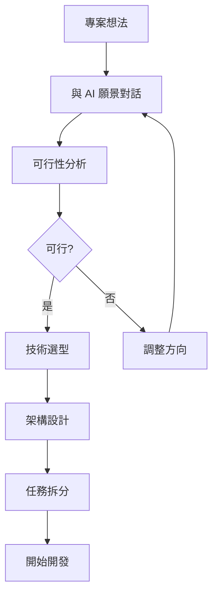
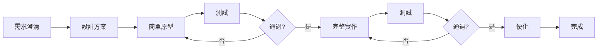
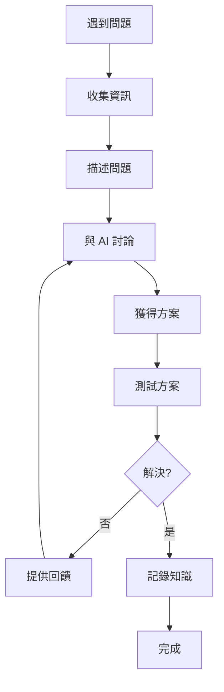
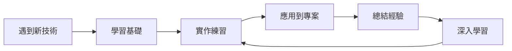

# AI 協作最佳實踐

> 與 Gemini 協作開發的實戰經驗總結

---

## 🎯 核心原則

### 1. 清晰溝通原則

**DO ✅**:
- 提供完整的上下文資訊
- 使用結構化的格式 (Markdown)
- 明確說明期望的輸出
- 附上相關的程式碼和錯誤訊息

**DON'T ❌**:
- 模糊的問題描述
- 缺少環境資訊
- 假設 AI 知道所有背景
- 一次問太多不相關的問題

---

### 2. 迭代開發原則

**DO ✅**:
- 從簡單原型開始
- 快速測試和回饋
- 逐步增加複雜度
- 每次迭代有明確目標

**DON'T ❌**:
- 一次要求完整功能
- 不測試就繼續開發
- 跳過基礎直接做複雜功能
- 沒有驗收標準

---

### 3. 知識累積原則

**DO ✅**:
- 記錄每次重要的對話
- 總結技術決策的理由
- 建立問題解決的知識庫
- 定期回顧和整理

**DON'T ❌**:
- 解決問題後就忘記
- 不記錄決策過程
- 重複問相同的問題
- 忽視經驗總結

---

## 💡 實戰技巧

### 技巧 1: 上下文管理

#### 開始新對話時
```markdown
## 專案上下文
- 專案: [名稱]
- 類型: [Web/Mobile/Desktop]
- 技術棧: [列表]
- 當前階段: [規劃/開發/測試/部署]
- 最後進度: [簡述]

## 當前任務
[具體描述要做什麼]
```

#### 繼續之前的對話
```markdown
## 接續上次
上次對話: [日期或主題]
已完成: [摘要]
當前狀態: [描述]

## 本次目標
[新的目標]
```

---

### 技巧 2: 問題描述

#### 功能開發請求
```markdown
## 功能需求
- 功能: [名稱]
- 目的: [為什麼需要]
- 用戶故事: 作為 [角色],我想要 [功能],以便 [價值]

## 技術要求
- 技術棧: [列表]
- 效能要求: [描述]
- 相容性: [要求]

## 驗收標準
- [ ] 標準 1
- [ ] 標準 2
- [ ] 標準 3
```

#### Bug 報告
```markdown
## 問題
- 簡述: [一句話]
- 嚴重程度: 🔴高 / 🟡中 / 🟢低
- 影響範圍: [描述]

## 重現步驟
1. [步驟 1]
2. [步驟 2]
3. [步驟 3]

## 預期行為
[應該怎樣]

## 實際行為
[實際怎樣]

## 環境
- 技術: [版本]
- 瀏覽器/OS: [資訊]

## 錯誤訊息
\`\`\`
[完整訊息]
\`\`\`
```

---

### 技巧 3: 程式碼協作

#### 請求程式碼審查
```markdown
## 審查請求
檔案: [路徑]
功能: [描述]

## 程式碼
\`\`\`typescript
// 完整程式碼
\`\`\`

## 審查重點
- [ ] 功能正確性
- [ ] 效能
- [ ] 安全性
- [ ] 可讀性
- [ ] 最佳實踐

## 特別關注
[有疑慮的部分]
```

#### 請求重構建議
```markdown
## 重構目標
- 檔案: [路徑]
- 問題: [當前問題]
- 目標: [想改善什麼]

## 當前程式碼
\`\`\`typescript
// 現有程式碼
\`\`\`

## 限制
- 必須保持: [功能/介面]
- 不能改變: [行為]

## 期望
[期望的改進方向]
```

---

### 技巧 4: 學習與成長

#### 學習新技術
```markdown
## 學習目標
技術: [名稱]
原因: [為什麼要學]
應用: [用在哪裡]

## 當前水平
- 已知: [相關技術]
- 經驗: [程度]

## 學習需求
請提供:
1. 核心概念清單
2. 學習路徑
3. 實作練習
4. 資源推薦
5. 常見陷阱
```

#### 深入理解
```markdown
## 深入主題
主題: [具體主題]
當前理解: [我的理解]

## 想了解
- 底層原理
- 設計思想
- 為什麼這樣設計
- 有什麼替代方案
- 各方案的權衡

## 學習方式
請用漸進式方式,從基礎到進階
```

---

## 🔄 工作流程最佳實踐

### 新專案啟動



**關鍵點**:
1. 充分的前期探索
2. 技術選型要有理由
3. 架構設計要清晰
4. 任務拆分要細緻

---

### 功能開發



**關鍵點**:
1. 先做原型驗證
2. 快速迭代
3. 充分測試
4. 持續優化

---

### 問題解決



**關鍵點**:
1. 完整的問題描述
2. 清晰的錯誤訊息
3. 已嘗試的方法
4. 及時的回饋
5. 知識的記錄

---

## 📊 效率提升技巧

### 1. 使用模板

建立常用的對話模板:
- 新功能開發模板
- Bug 修復模板
- 程式碼審查模板
- 學習請求模板

**好處**:
- 節省時間
- 確保完整性
- 提高溝通效率

---

### 2. 批次處理

將相關的小任務組合在一起:

```markdown
## 批次任務: UI 調整

請幫我完成以下 UI 調整:

1. **按鈕樣式**
   - 當前: [描述]
   - 期望: [描述]

2. **間距調整**
   - 當前: [描述]
   - 期望: [描述]

3. **顏色優化**
   - 當前: [描述]
   - 期望: [描述]

請一次性提供所有調整的程式碼
```

---

### 3. 上下文複用

在同一對話中處理相關任務:

```markdown
對話開始:
"我正在開發 [功能],請幫我實作"

→ 實作完成

"請為這個功能寫測試"

→ 測試完成

"請審查程式碼並優化"

→ 優化完成

"請生成文檔"
```

**好處**: AI 保持完整上下文,回答更準確

---

### 4. 漸進式細化

從粗到細,逐步完善:

```markdown
第 1 輪: "請設計 [功能] 的架構"
→ 獲得整體架構

第 2 輪: "請詳細設計 [模組 A]"
→ 獲得詳細設計

第 3 輪: "請實作 [模組 A]"
→ 獲得程式碼

第 4 輪: "請優化效能"
→ 獲得優化版本
```

---

## 🎯 品質保證

### 程式碼品質檢查清單

每次獲得程式碼後:
- [ ] 功能是否正確?
- [ ] 是否處理錯誤情況?
- [ ] 是否考慮邊界條件?
- [ ] 程式碼是否易讀?
- [ ] 是否遵循最佳實踐?
- [ ] 是否有效能問題?
- [ ] 是否有安全隱患?

---

### 測試策略

```markdown
## 測試計畫

### 單元測試
- [ ] 核心函數測試
- [ ] 邊界條件測試
- [ ] 錯誤處理測試

### 整合測試
- [ ] API 整合測試
- [ ] 資料庫操作測試
- [ ] 第三方服務測試

### 使用者測試
- [ ] 主要流程測試
- [ ] 邊緣案例測試
- [ ] 跨瀏覽器測試
```

---

## 📚 持續學習

### 學習循環



### 知識管理

每次學習後:
1. 記錄核心概念
2. 總結最佳實踐
3. 記錄常見陷阱
4. 建立範例程式碼
5. 連結相關資源

---

## 🌟 成功案例

### 案例 1: 快速原型開發

**情境**: 需要快速驗證求籤應用的可行性

**做法**:
1. 與 AI 討論核心功能
2. 請求最簡單的實作
3. 2 小時內完成可運行的原型
4. 驗證可行性後繼續開發

**結果**: 5 天完成完整應用

**關鍵**: 從簡單開始,快速迭代

---

### 案例 2: 問題快速解決

**情境**: SQLite MISUSE 錯誤

**做法**:
1. 收集完整錯誤訊息
2. 提供相關程式碼
3. 說明已嘗試的方法
4. 與 AI 討論根本原因
5. 測試解決方案

**結果**: 10 分鐘解決,原本可能需要數小時

**關鍵**: 完整的問題描述

---

### 案例 3: 技術學習

**情境**: 學習 Capacitor 跨平台開發

**做法**:
1. 請 AI 提供學習路徑
2. 從核心概念開始
3. 實作小型練習
4. 應用到實際專案
5. 記錄學習筆記

**結果**: 1 週內掌握基礎,可以開始實作

**關鍵**: 結構化學習,實作驅動

---

## 💡 進階技巧

### 1. 多輪對話策略

將複雜任務分解為多輪對話:

```
對話 1: 探索 - 了解需求和可能性
對話 2: 設計 - 確定架構和方案
對話 3: 實作 - 開發核心功能
對話 4: 優化 - 改進和完善
對話 5: 文檔 - 生成說明文檔
```

---

### 2. 並行開發

對於獨立的模組,可以並行開發:

```markdown
## 並行任務

請分別提供以下模組的實作:

### 模組 A: 使用者認證
[需求描述]

### 模組 B: 資料儲存
[需求描述]

### 模組 C: UI 元件
[需求描述]

這些模組是獨立的,請分別實作
```

---

### 3. 版本迭代

明確版本目標:

```markdown
## V1.0 目標
- [ ] 核心功能 A
- [ ] 核心功能 B
- [ ] 基本 UI

## V1.1 目標
- [ ] 功能優化
- [ ] UX 改進
- [ ] 效能提升

## V2.0 目標
- [ ] 新功能 C
- [ ] 跨平台支援
- [ ] 進階功能
```

---

## 🎓 學習資源

### 推薦閱讀
- [Prompt Engineering Guide](https://www.promptingguide.ai/)
- [The Art of Asking Questions](http://www.catb.org/~esr/faqs/smart-questions.html)

### 實踐建議
1. 每天至少一次高品質對話
2. 每週回顧對話效率
3. 持續優化對話模板
4. 建立個人最佳實踐庫

---

## 📈 效率指標

### 追蹤指標
- ⚡ 問題解決速度
- 🎯 一次解決率
- 📚 知識累積量
- 🚀 開發效率提升

### 目標設定
- 短期: 提高對話品質
- 中期: 建立知識體系
- 長期: 形成個人方法論

---

**版本**: 1.0  
**建立時間**: 2025-12-22  
**相關文檔**: 
- [Gemini驅動開發方法論](./Gemini驅動開發方法論.md)
- [對話驅動開發指南](./對話驅動開發指南.md)
